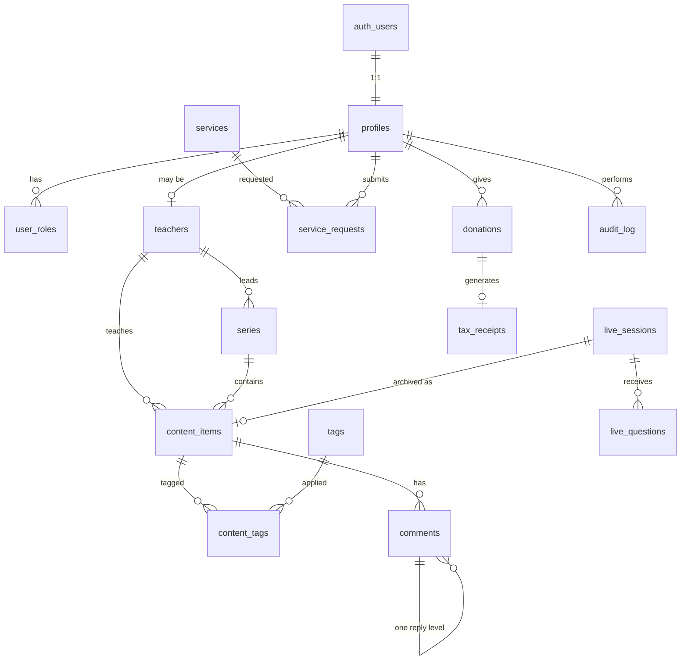

# Backend Schema, RLS & API

**Project:** Bodhisamadhi Center — Dharma Web Platform
**Related:** [PRD](./PRD-Bodhisamadhi-Center.md) · [Tech note](./1-Tech-Note-Data-Storage-Research.md) · [App flow decisions](./2-App-Flow-Open-Questions.md) · [Tech stack](./3-Tech-Stack-and-Version-Lock.md) · [Design system](./4-Design-System-and-Content-Guidelines.md)
**Date:** August 30, 2026
**Status:** Authoritative for all database and API work

---

## 1. Conventions

| Rule | Value |
|---|---|
| Primary keys | `uuid` default `gen_random_uuid()`. Never sequential — booking and donation IDs must not be enumerable. |
| Timestamps | `timestamptz`, always. Never `timestamp`. Store UTC; render in `America/Toronto`. |
| Naming | `snake_case`, plural tables, singular columns. Foreign keys `<table_singular>_id`. |
| Trilingual text | `jsonb` shaped `{"en": "...", "zh": "...", "bo": "..."}`. A missing key means no translation — the app falls back per design system §7.9. |
| Deletion | Soft: `deleted_at timestamptz`. RLS hides deleted rows from everyone but admins. |
| Audit | Every write by a master or admin lands in `audit_log` via trigger. |
| Money | `amount_cents integer`. Never floating point. |
| RLS | Enabled on every table in `public`. No table ships without policies. |
| Migrations | SQL files in `supabase/migrations/`, committed to git. Never edit schema in the dashboard. |

**The service-role key bypasses RLS entirely.** It is used only in server-side route handlers for webhook processing and admin operations, never in a Server Component, never in the browser.

---

## 2. Extensions

```sql
create extension if not exists "pgcrypto";   -- gen_random_uuid()
create extension if not exists "pg_trgm";    -- Chinese/Tibetan search
create extension if not exists "citext";     -- case-insensitive email
```

---

## 3. Enums

```sql
create type app_role        as enum ('master', 'admin');
create type content_type    as enum ('video', 'audio', 'script');
create type content_status  as enum ('draft', 'published', 'archived');
create type visibility      as enum ('public', 'members');
create type comment_status  as enum ('pending', 'approved', 'rejected');
create type live_status     as enum ('scheduled', 'live', 'ended', 'cancelled');
create type question_status as enum ('visible', 'removed');
create type request_status  as enum ('submitted', 'confirmed', 'completed', 'cancelled');
create type delivery_mode   as enum ('in_person', 'video_call', 'phone');
create type donation_method as enum ('card', 'paypal', 'emt');
create type donation_freq   as enum ('one_time', 'monthly');
create type donation_status as enum ('pending', 'completed', 'failed', 'refunded');
create type tag_kind        as enum ('topic', 'lineage');
create type locale          as enum ('en', 'zh', 'bo');
```

`app_role` contains only elevated roles. Every authenticated person is a user; that is the absence of a row, not a row.

---

## 4. Entity map



---

## 5. Identity

### 5.1 `profiles`

One row per account, created by trigger when `auth.users` gains a row. Supabase Auth owns email, password and verification; this table owns everything else.

```sql
create table public.profiles (
  id                  uuid primary key references auth.users(id) on delete cascade,
  display_name        text not null check (length(trim(display_name)) between 1 and 80),
  preferred_locale    locale not null default 'en',
  avatar_url          text,
  reminder_opt_in     boolean not null default false,
  announcements_opt_in boolean not null default false,
  age_confirmed_at    timestamptz,
  onboarded_at        timestamptz,
  deleted_at          timestamptz,
  created_at          timestamptz not null default now(),
  updated_at          timestamptz not null default now()
);

create index on public.profiles (deleted_at) where deleted_at is null;
```

Profiles are minimal by design (PRD §5.4). No bio, no public profile page, no social links.

### 5.2 `user_roles`

```sql
create table public.user_roles (
  user_id    uuid not null references public.profiles(id) on delete cascade,
  role       app_role not null,
  granted_by uuid references public.profiles(id),
  granted_at timestamptz not null default now(),
  primary key (user_id, role)
);
```

A person may hold both `master` and `admin`.

### 5.3 Role helpers — the critical piece

RLS policies must never query `user_roles` directly: `user_roles` has its own RLS, and a policy that reads it recurses infinitely. These `security definer` functions break the cycle. **Every policy that needs a role calls one of these.**

```sql
create or replace function public.has_role(_role app_role)
returns boolean
language sql
stable
security definer
set search_path = ''
as $$
  select exists (
    select 1 from public.user_roles
    where user_id = (select auth.uid()) and role = _role
  );
$$;

create or replace function public.is_admin() returns boolean
language sql stable security definer set search_path = ''
as $$ select public.has_role('admin'::public.app_role); $$;

create or replace function public.is_master() returns boolean
language sql stable security definer set search_path = ''
as $$ select public.has_role('master'::public.app_role); $$;

create or replace function public.is_staff() returns boolean
language sql stable security definer set search_path = ''
as $$ select public.is_admin() or public.is_master(); $$;

revoke execute on function public.has_role(app_role) from anon, authenticated;
grant execute on function public.is_admin(), public.is_master(), public.is_staff() to authenticated;
```

`set search_path = ''` and fully-qualified names are mandatory on every `security definer` function — without them a malicious search path can hijack the function.

**Write `(select auth.uid())`, not bare `auth.uid()`, in every policy.** The subquery form is evaluated once per statement instead of once per row; on a library page the difference is roughly an order of magnitude.

### 5.4 Profile creation trigger

```sql
create or replace function public.handle_new_user()
returns trigger language plpgsql security definer set search_path = ''
as $$
begin
  insert into public.profiles (id, display_name, preferred_locale)
  values (
    new.id,
    coalesce(new.raw_user_meta_data->>'display_name', split_part(new.email, '@', 1)),
    coalesce((new.raw_user_meta_data->>'locale')::public.locale, 'en'::public.locale)
  );
  -- Link any guest service requests made with this email (App Flow F39)
  update public.service_requests
     set requester_profile_id = new.id
   where guest_email = new.email and requester_profile_id is null;
  return new;
end;
$$;

create trigger on_auth_user_created
  after insert on auth.users
  for each row execute function public.handle_new_user();
```

---

## 6. Taxonomy

### 6.1 `teachers`

A teacher is not the same thing as an account. Geshe-la has a public teacher record whether or not he ever signs in; a `profile_id` links the two when he does.

```sql
create table public.teachers (
  id            uuid primary key default gen_random_uuid(),
  profile_id    uuid unique references public.profiles(id) on delete set null,
  slug          text not null unique check (slug ~ '^[a-z0-9-]+$'),
  honorific     text,                    -- 'Venerable', 'His Eminence'
  name          jsonb not null,          -- {en, zh, bo}
  bio           jsonb not null default '{}'::jsonb,
  photo_url     text,
  display_order integer not null default 0,
  is_active     boolean not null default true,
  deleted_at    timestamptz,
  created_at    timestamptz not null default now(),
  updated_at    timestamptz not null default now()
);
```

Honorifics are stored, not composed in code — design system §7.2 fixes the exact forms.

### 6.2 `series`

```sql
create table public.series (
  id          uuid primary key default gen_random_uuid(),
  slug        text not null unique check (slug ~ '^[a-z0-9-]+$'),
  title       jsonb not null,
  description jsonb not null default '{}'::jsonb,
  teacher_id  uuid references public.teachers(id) on delete set null,
  deleted_at  timestamptz,
  created_at  timestamptz not null default now(),
  updated_at  timestamptz not null default now()
);
```

### 6.3 `tags` and `content_tags`

```sql
create table public.tags (
  id         uuid primary key default gen_random_uuid(),
  kind       tag_kind not null,
  slug       text not null check (slug ~ '^[a-z0-9-]+$'),
  label      jsonb not null,
  created_at timestamptz not null default now(),
  unique (kind, slug)
);

create table public.content_tags (
  content_item_id uuid not null references public.content_items(id) on delete cascade,
  tag_id          uuid not null references public.tags(id) on delete cascade,
  primary key (content_item_id, tag_id)
);

create index on public.content_tags (tag_id);
```

---

## 7. Content

### 7.1 `content_items`

One table, one `type` discriminator. Type-specific columns are nullable and constrained so a row cannot be internally inconsistent.

```sql
create table public.content_items (
  id               uuid primary key default gen_random_uuid(),
  type             content_type not null,
  status           content_status not null default 'draft',
  visibility       visibility not null default 'public',

  slug             text not null unique check (slug ~ '^[a-z0-9-]+$'),
  title            jsonb not null,
  description      jsonb not null default '{}'::jsonb,

  teacher_id       uuid references public.teachers(id) on delete set null,
  series_id        uuid references public.series(id) on delete set null,
  part_number      integer check (part_number > 0),

  -- video
  youtube_id       text check (youtube_id ~ '^[A-Za-z0-9_-]{11}$'),
  -- audio
  audio_url        text,
  -- script
  pdf_url          text,
  pdf_pages        integer check (pdf_pages > 0),
  allow_download   boolean not null default true,

  thumbnail_url    text,
  duration_seconds integer check (duration_seconds >= 0),
  recorded_at      date,
  published_at     timestamptz,

  live_session_id  uuid references public.live_sessions(id) on delete set null,
  -- ^ Phase 2 omits this column and FK — `live_sessions` does not exist
  --   until Phase 16, which adds it back with `alter table`.

  created_by       uuid references public.profiles(id) on delete set null,
  deleted_at       timestamptz,
  created_at       timestamptz not null default now(),
  updated_at       timestamptz not null default now(),

  -- a row must carry the payload its type requires
  constraint content_payload_matches_type check (
    (type = 'video'  and youtube_id is not null and audio_url is null and pdf_url is null) or
    (type = 'audio'  and audio_url  is not null and youtube_id is null and pdf_url is null) or
    (type = 'script' and pdf_url    is not null and youtube_id is null and audio_url is null)
  ),
  constraint published_has_date check (
    status <> 'published' or published_at is not null
  ),
  constraint series_part_together check (
    (series_id is null and part_number is null) or (series_id is not null)
  )
);

create index on public.content_items (status, visibility, published_at desc)
  where deleted_at is null;
create index on public.content_items (type, published_at desc) where deleted_at is null;
create index on public.content_items (teacher_id) where deleted_at is null;
create index on public.content_items (series_id, part_number) where deleted_at is null;
create unique index on public.content_items (series_id, part_number)
  where series_id is not null and part_number is not null and deleted_at is null;
```

`allow_download` is meaningful for scripts (design system / App Flow B13) and ignored for other types.

### 7.2 Search

Postgres ships no text-search configuration for Chinese or Tibetan. English gets real full-text search; the other two get trigram substring matching, which is the honest answer at this scale and needs no extra service.

```sql
alter table public.content_items
  add column search_en tsvector
    generated always as (
      setweight(to_tsvector('english', coalesce(title->>'en','')), 'A') ||
      setweight(to_tsvector('english', coalesce(description->>'en','')), 'B')
    ) stored,
  add column search_cjk text
    generated always as (
      coalesce(title->>'zh','') || ' ' || coalesce(description->>'zh','') || ' ' ||
      coalesce(title->>'bo','') || ' ' || coalesce(description->>'bo','')
    ) stored;

create index content_search_en_idx  on public.content_items using gin (search_en);
create index content_search_cjk_idx on public.content_items using gin (search_cjk extensions.gin_trgm_ops);
```

> **As-built (Phase 2):** extensions are installed into the `extensions` schema (Supabase convention), so `pg_trgm`'s operator class and `similarity()` are qualified — `extensions.gin_trgm_ops`, `extensions.similarity(…)` — because `search_content` runs with `search_path = ''`.

Search is executed by a single function so the app never assembles the query itself:

```sql
create or replace function public.search_content(_q text, _locale locale default 'en')
returns setof public.content_items
language sql stable
set search_path = ''
as $$
  select c.* from public.content_items c
  where c.deleted_at is null
    and c.status = 'published'
    and (
      case when _locale = 'en'
        then c.search_en @@ websearch_to_tsquery('english', _q)
        else c.search_cjk ilike '%' || _q || '%'
      end
    )
  order by
    case when _locale = 'en'
      then ts_rank(c.search_en, websearch_to_tsquery('english', _q))
      else extensions.similarity(c.search_cjk, _q)
    end desc,
    c.published_at desc
  limit 100;
$$;
```

RLS still applies to the rows this returns, so a guest never sees a members-only item's row through it.

### 7.3 `comments`

```sql
create table public.comments (
  id              uuid primary key default gen_random_uuid(),
  content_item_id uuid not null references public.content_items(id) on delete cascade,
  author_id       uuid not null references public.profiles(id) on delete cascade,
  parent_id       uuid references public.comments(id) on delete cascade,
  body            text not null check (length(trim(body)) between 1 and 4000),
  status          comment_status not null default 'pending',
  moderated_by    uuid references public.profiles(id) on delete set null,
  moderated_at    timestamptz,
  deleted_at      timestamptz,
  created_at      timestamptz not null default now(),
  updated_at      timestamptz not null default now()
);

create index on public.comments (content_item_id, status, created_at desc) where deleted_at is null;
create index on public.comments (status, created_at) where status = 'pending' and deleted_at is null;
create index on public.comments (author_id) where deleted_at is null;
```

**One reply level only** (design system §3.18), enforced in the database rather than trusted to the UI:

> **Corrected 2026-09-04 (Phase 14):** the function is `security definer`. Without it the parent lookup runs under the caller's RLS, so a parent the caller cannot select reads as absent and the nesting check silently passes — this trigger is the stated DB guarantee for `Docs/2` E32, so it must see every row. It also now refuses a reply whose parent sits on a *different* content item (`buildThread()` would otherwise drop it silently).

```sql
create or replace function public.enforce_single_reply_level()
returns trigger language plpgsql security definer set search_path = ''
as $$
declare
  parent record;
begin
  if new.parent_id is not null then
    select c.parent_id, c.content_item_id into parent
      from public.comments c where c.id = new.parent_id;
    if found then
      if parent.parent_id is not null then
        raise exception 'Replies may not be nested more than one level deep';
      end if;
      if parent.content_item_id <> new.content_item_id then
        raise exception 'A reply must be on the same content item as its parent';
      end if;
    end if;
  end if;
  return new;
end;
$$;

create trigger comments_single_reply_level
  before insert or update on public.comments
  for each row execute function public.enforce_single_reply_level();
```

**Masters' comments bypass moderation** (App Flow E34):

```sql
create or replace function public.auto_approve_staff_comment()
returns trigger language plpgsql security definer set search_path = ''
as $$
begin
  if exists (select 1 from public.user_roles where user_id = new.author_id) then
    new.status := 'approved';
    new.moderated_at := now();
  end if;
  return new;
end;
$$;

create trigger comments_auto_approve
  before insert on public.comments
  for each row execute function public.auto_approve_staff_comment();
```

---

## 8. Live

### 8.1 `live_sessions`

```sql
create table public.live_sessions (
  id                 uuid primary key default gen_random_uuid(),
  title              jsonb not null,
  description        jsonb not null default '{}'::jsonb,
  scheduled_start_at timestamptz not null,
  chat_opens_at      timestamptz generated always as
                       (scheduled_start_at - interval '30 minutes') stored,
  actual_start_at    timestamptz,
  ended_at           timestamptz,
  status             live_status not null default 'scheduled',
  youtube_video_id   text check (youtube_video_id ~ '^[A-Za-z0-9_-]{11}$'),
  notice             text,                      -- admin message during a technical fault
  recording_id       uuid references public.content_items(id) on delete set null,
  created_by         uuid references public.profiles(id) on delete set null,
  deleted_at         timestamptz,
  created_at         timestamptz not null default now(),
  updated_at         timestamptz not null default now()
);

create index on public.live_sessions (status, scheduled_start_at desc) where deleted_at is null;
create unique index one_live_session_at_a_time
  on public.live_sessions ((status)) where status = 'live' and deleted_at is null;
```

The partial unique index makes "two streams live at once" impossible — the sitewide live banner (design system §3.21) assumes exactly one.

The six page states in the App Flow derive from these columns; the app computes them, it does not store them:

| App Flow state | Condition |
|---|---|
| Nothing scheduled | no row with `status='scheduled'` and `scheduled_start_at > now()` |
| Upcoming, countdown | `status='scheduled'` and `now() < chat_opens_at` |
| Waiting room | `status='scheduled'` and `now() >= chat_opens_at` |
| On air | `status='live'` |
| Ended, recording pending | `status='ended'` and `recording_id is null` |
| Cancelled | `status='cancelled'` |

### 8.2 `live_questions`

Post-moderated, unlike comments (App Flow C20 — the documented exception to PRD §5.5).

```sql
create table public.live_questions (
  id              uuid primary key default gen_random_uuid(),
  live_session_id uuid not null references public.live_sessions(id) on delete cascade,
  author_id       uuid not null references public.profiles(id) on delete cascade,
  body            text not null check (length(trim(body)) between 1 and 500),
  status          question_status not null default 'visible',
  removed_by      uuid references public.profiles(id) on delete set null,
  removed_at      timestamptz,
  created_at      timestamptz not null default now()
);

create index on public.live_questions (live_session_id, created_at desc);

alter publication supabase_realtime add table public.live_questions;
```

Rate limiting, so one person cannot flood the session:

```sql
create or replace function public.limit_question_rate()
returns trigger language plpgsql set search_path = ''
as $$
begin
  if (select count(*) from public.live_questions
      where author_id = new.author_id and created_at > now() - interval '1 minute') >= 5 then
    raise exception 'Please wait a moment before asking another question';
  end if;
  return new;
end;
$$;

create trigger live_questions_rate_limit
  before insert on public.live_questions
  for each row execute function public.limit_question_rate();
```

---

## 9. Services & requests

### 9.1 `services`

```sql
create table public.services (
  id              uuid primary key default gen_random_uuid(),
  slug            text not null unique check (slug ~ '^[a-z0-9-]+$'),
  name            jsonb not null,
  description     jsonb not null default '{}'::jsonb,
  delivery_modes  delivery_mode[] not null default '{in_person}',
  is_sensitive    boolean not null default false,
  display_order   integer not null default 0,
  is_active       boolean not null default true,
  deleted_at      timestamptz,
  created_at      timestamptz not null default now(),
  updated_at      timestamptz not null default now()
);
```

`is_sensitive` is `true` for Counseling, End-of-Life Guidance and Puja by Request. The app uses it to require the pastoral disclaimer above the form and to suppress emoji (design system §7.11). It is a data flag, not a styling choice, so it cannot be forgotten on a new page.

"Sponsor a Puja" is **not** a service — it is a donation with a dedication (App Flow G46).

### 9.2 `service_requests`

Guests may submit without an account (App Flow F39), so `requester_profile_id` is nullable and a contact email is always required.

```sql
create table public.service_requests (
  id                   uuid primary key default gen_random_uuid(),
  service_id           uuid not null references public.services(id) on delete restrict,
  requester_profile_id uuid references public.profiles(id) on delete set null,
  guest_email          citext not null,
  guest_name           text not null check (length(trim(guest_name)) between 1 and 120),
  phone                text,
  preferred_locale     locale not null default 'en',
  preferred_times      text,
  delivery_mode        delivery_mode not null,
  message              text check (length(message) <= 4000),
  status               request_status not null default 'submitted',
  assigned_teacher_id  uuid references public.teachers(id) on delete set null,
  scheduled_at         timestamptz,
  confirmed_at         timestamptz,
  completed_at         timestamptz,
  deleted_at           timestamptz,
  created_at           timestamptz not null default now(),
  updated_at           timestamptz not null default now()
);

create index on public.service_requests (status, created_at desc) where deleted_at is null;
create index on public.service_requests (requester_profile_id) where deleted_at is null;
create index on public.service_requests (guest_email);
```

### 9.3 `request_notes`

Staff notes live in their own table rather than as a column on `service_requests`. The reason is that RLS grants access per **row**, not per column, and staff are the same `authenticated` Postgres role as everyone else — so a `staff_notes` column on the request itself could not be reliably hidden from the person who submitted it. On a counseling or end-of-life request that is a real confidentiality boundary, not a nicety.

```sql
create table public.request_notes (
  id                 uuid primary key default gen_random_uuid(),
  service_request_id uuid not null references public.service_requests(id) on delete cascade,
  author_id          uuid not null references public.profiles(id) on delete set null,
  body               text not null check (length(trim(body)) between 1 and 4000),
  created_at         timestamptz not null default now()
);

create index on public.request_notes (service_request_id, created_at desc);
```

Its RLS admits staff only — the requester has no policy granting them a row, so the notes are invisible to them at the database level whatever the API does.

---

## 10. Donations

### 10.1 `donations`

The payment processor is the source of truth for money. This table is the center's own record, reconciled to it.

```sql
create table public.donations (
  id                       uuid primary key default gen_random_uuid(),
  donor_profile_id         uuid references public.profiles(id) on delete set null,
  donor_email              citext not null,
  donor_name               text not null,
  amount_cents             integer not null check (amount_cents > 0),
  currency                 char(3) not null default 'CAD',
  method                   donation_method not null,
  frequency                donation_freq not null default 'one_time',
  status                   donation_status not null default 'pending',

  stripe_payment_intent_id text unique,
  stripe_subscription_id   text,
  paypal_order_id          text unique,
  emt_reference_code       text unique,

  dedication_name          text,     -- "Sponsor a Puja" (App Flow G46)
  dedication_intention     text,

  reconciled_by            uuid references public.profiles(id) on delete set null,
  reconciled_at            timestamptz,
  completed_at             timestamptz,
  created_at               timestamptz not null default now(),
  updated_at               timestamptz not null default now(),

  constraint emt_needs_reference check (method <> 'emt' or emt_reference_code is not null),
  constraint completed_has_date  check (status <> 'completed' or completed_at is not null)
);

create index on public.donations (donor_profile_id, created_at desc);
create index on public.donations (status, method) where status = 'pending';
create index on public.donations (donor_email);
```

The unique constraints on the processor IDs are what make webhook handling idempotent — Stripe will deliver the same event twice, and the second insert simply conflicts.

EMT reference codes are generated, never chosen:

```sql
create or replace function public.generate_emt_reference()
returns text language sql volatile set search_path = ''
as $$ select 'BSC-' || upper(substring(encode(gen_random_bytes(4), 'hex') from 1 for 6)); $$;
```

### 10.2 `tax_receipts`

CRA receipts need a gapless sequence — a Postgres sequence would leave gaps on rollback, which is exactly what an auditor asks about.

```sql
create table public.tax_receipts (
  id               uuid primary key default gen_random_uuid(),
  donation_id      uuid not null unique references public.donations(id) on delete restrict,
  receipt_number   text not null unique,
  issued_at        timestamptz not null default now(),
  tax_year         integer not null,
  donor_name       text not null,
  donor_address    text,
  amount_cents     integer not null check (amount_cents > 0),
  pdf_url          text,
  reissued_from    uuid references public.tax_receipts(id) on delete set null,
  created_at       timestamptz not null default now()
);

create table public.receipt_counters (
  tax_year integer primary key,
  last_seq integer not null default 0
);

create or replace function public.next_receipt_number(_year integer)
returns text language plpgsql volatile security definer set search_path = ''
as $$
declare _seq integer;
begin
  insert into public.receipt_counters (tax_year, last_seq) values (_year, 1)
    on conflict (tax_year) do update set last_seq = public.receipt_counters.last_seq + 1
    returning last_seq into _seq;
  return _year::text || '-' || lpad(_seq::text, 5, '0');
end;
$$;
```

`on delete restrict` on `donation_id` is deliberate: a donation with a receipt issued against it must never be deleted.

> **⚠ Open item.** The exact fields CRA requires on a receipt are listed as unresolved in PRD §12. `donor_address` is included because CRA generally requires it; confirm the full field list before issuing a single receipt.

---

## 11. Supporting tables

```sql
create table public.email_log (
  id          uuid primary key default gen_random_uuid(),
  profile_id  uuid references public.profiles(id) on delete set null,
  to_email    citext not null,
  template    text not null,
  locale      locale not null,
  resend_id   text,
  status      text not null default 'sent',
  error       text,
  sent_at     timestamptz not null default now()
);
create index on public.email_log (profile_id, sent_at desc);
create index on public.email_log (template, sent_at desc);

create table public.audit_log (
  id          bigint generated always as identity primary key,
  actor_id    uuid references public.profiles(id) on delete set null,
  action      text not null,               -- 'insert' | 'update' | 'delete'
  entity_type text not null,
  entity_id   uuid,
  before      jsonb,
  after       jsonb,
  created_at  timestamptz not null default now()
);
create index on public.audit_log (entity_type, entity_id, created_at desc);
create index on public.audit_log (actor_id, created_at desc);
```

`audit_log` is the one table with a `bigint` key — it is append-only, never exposed by URL, and will hold far more rows than anything else.

---

## 12. Shared triggers

### 12.1 `updated_at`

```sql
create or replace function public.touch_updated_at()
returns trigger language plpgsql set search_path = ''
as $$ begin new.updated_at := now(); return new; end; $$;
```

Attach to every table carrying `updated_at`: `profiles`, `teachers`, `series`, `content_items`, `comments`, `live_sessions`, `services`, `service_requests`, `donations`.

```sql
create trigger touch_updated_at before update on public.content_items
  for each row execute function public.touch_updated_at();
-- repeat per table
```

### 12.2 Audit

> **Corrected during Phase 2.** `coalesce(new.id, old.id)` raises *"record new has no field id"* on `user_roles`, whose key is the composite `(user_id, role)`. The id is read from the row's `jsonb` instead — a composite-key table simply gets a null `entity_id`, with the full row in `before` / `after`. As-built migration: `supabase/migrations/0005_audit.sql`.

```sql
create or replace function public.write_audit()
returns trigger language plpgsql security definer set search_path = ''
as $$
declare
  _before jsonb := case when tg_op in ('UPDATE','DELETE') then to_jsonb(old) end;
  _after  jsonb := case when tg_op in ('INSERT','UPDATE') then to_jsonb(new) end;
begin
  insert into public.audit_log (actor_id, action, entity_type, entity_id, before, after)
  values (
    (select auth.uid()),
    lower(tg_op),
    tg_table_name,
    nullif(coalesce(_after ->> 'id', _before ->> 'id'), '')::uuid,
    _before,
    _after
  );
  return coalesce(new, old);
end;
$$;
```

Attach to `content_items`, `comments`, `services`, `service_requests`, `donations`, `user_roles`, `live_sessions`, `teachers`.

### 12.3 Publishing

```sql
create or replace function public.stamp_published_at()
returns trigger language plpgsql set search_path = ''
as $$
begin
  if new.status = 'published' and (old.status is distinct from 'published')
     and new.published_at is null then
    new.published_at := now();
  end if;
  return new;
end;
$$;
```

---

## 13. Row Level Security

Enable on everything first. A table without RLS in `public` is readable by anyone holding the anon key.

```sql
alter table public.profiles          enable row level security;
alter table public.user_roles        enable row level security;
alter table public.teachers          enable row level security;
alter table public.series            enable row level security;
alter table public.tags              enable row level security;
alter table public.content_tags      enable row level security;
alter table public.content_items     enable row level security;
alter table public.comments          enable row level security;
alter table public.live_sessions     enable row level security;
alter table public.live_questions    enable row level security;
alter table public.services          enable row level security;
alter table public.service_requests  enable row level security;
alter table public.request_notes     enable row level security;
alter table public.donations         enable row level security;
alter table public.tax_receipts      enable row level security;
alter table public.receipt_counters  enable row level security;
alter table public.email_log         enable row level security;
alter table public.audit_log         enable row level security;
```

### 13.1 Profiles — private by default

```sql
create policy "own profile readable" on public.profiles
  for select to authenticated
  using ((select auth.uid()) = id);

create policy "admins read all profiles" on public.profiles
  for select to authenticated using (public.is_admin());

create policy "own profile editable" on public.profiles
  for update to authenticated
  using ((select auth.uid()) = id) with check ((select auth.uid()) = id);

create policy "admins manage profiles" on public.profiles
  for all to authenticated using (public.is_admin()) with check (public.is_admin());
```

There is deliberately **no public read on `profiles`**. A member list is not public information for a religious centre. Comment authors' display names are exposed only through §13.5's function, and only for comments that are actually visible.

### 13.2 Roles

```sql
create policy "see own roles" on public.user_roles
  for select to authenticated using ((select auth.uid()) = user_id);

create policy "admins read roles" on public.user_roles
  for select to authenticated using (public.is_admin());

create policy "admins assign roles" on public.user_roles
  for all to authenticated using (public.is_admin()) with check (public.is_admin());
```

### 13.3 Taxonomy — public read, admin write

```sql
create policy "teachers public" on public.teachers
  for select to anon, authenticated using (deleted_at is null and is_active);
create policy "teachers admin write" on public.teachers
  for all to authenticated using (public.is_admin()) with check (public.is_admin());

create policy "series public" on public.series
  for select to anon, authenticated using (deleted_at is null);
create policy "series staff write" on public.series
  for all to authenticated using (public.is_staff()) with check (public.is_staff());

create policy "tags public" on public.tags for select to anon, authenticated using (true);
create policy "tags admin write" on public.tags
  for all to authenticated using (public.is_admin()) with check (public.is_admin());

create policy "content_tags public" on public.content_tags
  for select to anon, authenticated using (true);
create policy "content_tags staff write" on public.content_tags
  for all to authenticated using (public.is_staff()) with check (public.is_staff());
```

### 13.4 Content — where the members-only rule actually lives

```sql
-- Guests: published, public, not deleted
create policy "public content readable by anyone" on public.content_items
  for select to anon
  using (status = 'published' and visibility = 'public' and deleted_at is null);

-- Members: published, either visibility
create policy "members read published content" on public.content_items
  for select to authenticated
  using (status = 'published' and deleted_at is null);

-- Staff: everything, drafts included
create policy "staff read all content" on public.content_items
  for select to authenticated using (public.is_staff());

create policy "staff create content" on public.content_items
  for insert to authenticated
  with check (public.is_staff() and created_by = (select auth.uid()));

create policy "masters edit own, admins edit all" on public.content_items
  for update to authenticated
  using (public.is_admin() or (public.is_master() and created_by = (select auth.uid())))
  with check (public.is_admin() or (public.is_master() and created_by = (select auth.uid())));

create policy "admins delete content" on public.content_items
  for delete to authenticated using (public.is_admin());
```

This is the whole of the members-only gate: a logged-out visitor's query cannot return the row. The App Flow's "visible with a lock badge" listing (B16) is therefore built from a **separate, deliberately public projection** — the app fetches title, teacher, thumbnail and visibility for the card, and the playable payload is simply absent for guests.

```sql
create or replace function public.list_library_cards(
  _type content_type default null, _limit int default 24, _offset int default 0
) returns table (
  id uuid, type content_type, slug text, title jsonb, thumbnail_url text,
  teacher_name jsonb, published_at timestamptz, duration_seconds integer,
  is_locked boolean
) language sql stable security definer set search_path = ''
as $$
  select c.id, c.type, c.slug, c.title, c.thumbnail_url,
         t.name, c.published_at, c.duration_seconds,
         (c.visibility = 'members' and (select auth.uid()) is null) as is_locked
  from public.content_items c
  left join public.teachers t on t.id = c.teacher_id
  where c.status = 'published' and c.deleted_at is null
    and (_type is null or c.type = _type)
  order by c.published_at desc
  limit least(_limit, 60) offset _offset;
$$;

grant execute on function public.list_library_cards to anon, authenticated;
```

Note what this function does **not** return: `youtube_id`, `audio_url`, `pdf_url`. A locked card is advertising, never a leak.

### 13.5 Comments

> **Corrected 2026-09-04 (Phase 14):** added the missing per-column INSERT grant — `authenticated` previously held INSERT on every column and the `"members may comment"` policy did not constrain `status`, allowing a member to self-approve. Also note: withdrawal (`deleted_at`) now goes through the `security definer` `withdraw_comment()` function; `authenticated` has no UPDATE grant on `comments` at all. The SELECT policies below stand as originally written — an interim relaxation of `"authors see their own pending comments"` (dropping `and deleted_at is null` to make a direct withdraw UPDATE possible) was built and then removed; `withdraw_comment()` replaces it. `list_comments()` also gained an `is_staff()` clause and a published-item check — see the note below it.

```sql
create policy "approved comments are public" on public.comments
  for select to anon, authenticated
  using (status = 'approved' and deleted_at is null);

create policy "authors see their own pending comments" on public.comments
  for select to authenticated
  using ((select auth.uid()) = author_id and deleted_at is null);

create policy "staff see all comments" on public.comments
  for select to authenticated using (public.is_staff());

create policy "members may comment" on public.comments
  for insert to authenticated
  with check (
    (select auth.uid()) = author_id
    and exists (select 1 from public.content_items ci
                where ci.id = content_item_id
                  and ci.status = 'published' and ci.deleted_at is null)
  );

create policy "authors may withdraw own comment" on public.comments
  for update to authenticated
  using ((select auth.uid()) = author_id)
  with check ((select auth.uid()) = author_id);

create policy "staff moderate comments" on public.comments
  for update to authenticated
  using (public.is_staff()) with check (public.is_staff());
```

Both UPDATE policies above are **inert**: `authenticated` holds no UPDATE grant on `comments` at all. Authors cannot edit (design system §3.18); moderation goes through `moderate_comments()` and withdrawal through `withdraw_comment()`, both `security definer`. The policies are kept as documented intent and defence in depth.

INSERT is likewise confined by column grant. Without it `authenticated` holds INSERT on every column and `"members may comment"` does not constrain `status` — a member could POST `status = 'approved'` and bypass moderation, or forge `created_at` (evading `limit_comment_rate`) or `moderated_by` / `moderated_at`. Column grants police only the columns *named in the INSERT statement*, so `auto_approve_staff_comment()` — which sets `NEW.status` in a trigger — is unaffected.

```sql
revoke update on public.comments from anon, authenticated;

revoke insert on public.comments from anon, authenticated;
grant insert (content_item_id, author_id, parent_id, body)
  on public.comments to authenticated;
```

An author withdraws their own comment through a `security definer` function. It runs above both the revoked UPDATE grant and the `"authors see their own pending comments"` SELECT policy — Postgres re-checks an UPDATE's resulting row against the caller's SELECT policies, and a just-withdrawn row would fail that check. A call on anyone else's id is a silent no-op:

```sql
create or replace function public.withdraw_comment(_id uuid)
returns void language sql volatile security definer set search_path = ''
as $$
  update public.comments set deleted_at = now()
   where id = _id
     and author_id = (select auth.uid())
     and deleted_at is null;
$$;

revoke execute on function public.withdraw_comment(uuid) from anon;
grant execute on function public.withdraw_comment(uuid) to authenticated;
```

Reading a thread with author names, without exposing `profiles`:

```sql
create or replace function public.list_comments(_content_item_id uuid)
returns table (
  id uuid, parent_id uuid, body text, status comment_status,
  created_at timestamptz, author_name text, author_avatar text,
  author_is_master boolean, is_own boolean
) language sql stable security definer set search_path = ''
as $$
  select c.id, c.parent_id, c.body, c.status, c.created_at,
         p.display_name, p.avatar_url,
         exists (select 1 from public.user_roles r
                 where r.user_id = c.author_id and r.role = 'master'),
         c.author_id = (select auth.uid())
  from public.comments c
  join public.profiles p on p.id = c.author_id
  where c.content_item_id = _content_item_id
    and c.deleted_at is null
    and (c.status = 'approved'
         or c.author_id = (select auth.uid())
         or public.is_staff())
    and exists (select 1 from public.content_items ci
                where ci.id = _content_item_id
                  and ci.status = 'published' and ci.deleted_at is null)
  order by c.created_at asc;
$$;

grant execute on function public.list_comments to anon, authenticated;
```

The `or public.is_staff()` clause exists so a moderator following the admin queue's in-context link (`…#comment-<id>`) actually sees the pending row it anchors on. The `content_items` check exists because the function is granted to `anon` and takes an arbitrary uuid — without it, comments on an item that has since been unpublished or archived stay readable. Both added 2026-09-04 (Phase 14 final review).

### 13.6 Live

```sql
create policy "live sessions public" on public.live_sessions
  for select to anon, authenticated using (deleted_at is null);
create policy "admins manage live" on public.live_sessions
  for all to authenticated using (public.is_admin()) with check (public.is_admin());

-- Guests may read the chat but not post (App Flow C21)
create policy "questions readable by all" on public.live_questions
  for select to anon, authenticated using (status = 'visible');
create policy "staff read removed questions" on public.live_questions
  for select to authenticated using (public.is_staff());

create policy "members ask questions" on public.live_questions
  for insert to authenticated
  with check (
    (select auth.uid()) = author_id
    and exists (
      select 1 from public.live_sessions s
      where s.id = live_session_id
        and s.deleted_at is null
        and (s.status = 'live' or (s.status = 'scheduled' and now() >= s.chat_opens_at))
    )
  );

create policy "staff remove questions" on public.live_questions
  for update to authenticated using (public.is_staff()) with check (public.is_staff());
```

Questions can only be posted while the waiting room is open or the session is live — the window is enforced by the database, not by hiding the input box.

### 13.7 Services & requests

```sql
create policy "services public" on public.services
  for select to anon, authenticated using (is_active and deleted_at is null);
create policy "admins manage services" on public.services
  for all to authenticated using (public.is_admin()) with check (public.is_admin());

-- Guests may submit (App Flow F39)
create policy "anyone may request a service" on public.service_requests
  for insert to anon, authenticated
  with check (
    requester_profile_id is null or requester_profile_id = (select auth.uid())
  );

create policy "requesters read own" on public.service_requests
  for select to authenticated
  using (requester_profile_id = (select auth.uid()));

create policy "staff read requests" on public.service_requests
  for select to authenticated using (public.is_staff());
create policy "staff manage requests" on public.service_requests
  for update to authenticated using (public.is_staff()) with check (public.is_staff());

-- Notes: staff only, in both directions
create policy "staff read notes" on public.request_notes
  for select to authenticated using (public.is_staff());
create policy "staff write notes" on public.request_notes
  for all to authenticated using (public.is_staff()) with check (public.is_staff());
```

A guest submitting anonymously cannot read their own request back — they have no session. The confirmation page renders from the insert's return value, and everything afterwards happens by email.

### 13.8 Donations & receipts

```sql
create policy "donors read own donations" on public.donations
  for select to authenticated
  using (donor_profile_id = (select auth.uid()));
create policy "admins read donations" on public.donations
  for select to authenticated using (public.is_admin());
create policy "admins reconcile donations" on public.donations
  for update to authenticated using (public.is_admin()) with check (public.is_admin());

create policy "donors read own receipts" on public.tax_receipts
  for select to authenticated
  using (exists (select 1 from public.donations d
                 where d.id = donation_id and d.donor_profile_id = (select auth.uid())));
create policy "admins read receipts" on public.tax_receipts
  for select to authenticated using (public.is_admin());
```

**There is no insert policy on `donations` or `tax_receipts`.** Records are written exclusively by server-side route handlers using the service-role key, after the processor confirms the money. A client can never create a donation row, which means a client can never fabricate one.

Masters can see content, comments and bookings. Masters cannot see donations at all — that separation is intentional.

### 13.9 Logs

```sql
create policy "admins read email log" on public.email_log
  for select to authenticated using (public.is_admin());
create policy "admins read audit" on public.audit_log
  for select to authenticated using (public.is_admin());
```

No insert policies: both are written by `security definer` triggers and server code. `receipt_counters` gets no policy at all — it is service-role only.

---

## 14. Storage

Two stores, per the tech note §9.

| Content | Where | Access |
|---|---|---|
| Audio (MP3) | **Cloudflare R2** | Private bucket. The server issues a short-lived signed URL (15 min) after checking visibility. |
| Scripts (PDF) | **Cloudflare R2** | Private bucket. Signed URL; download link issued only when `allow_download` is true. |
| Thumbnails | **Supabase Storage**, public bucket `thumbnails` | Public read, staff write |
| Avatars | **Supabase Storage**, public bucket `avatars` | Public read, owner write |
| Receipt PDFs | **Supabase Storage**, private bucket `receipts` | Signed URL to the donor and admins only |

```sql
create policy "avatar readable" on storage.objects
  for select to anon, authenticated using (bucket_id = 'avatars');

create policy "own avatar writable" on storage.objects
  for insert to authenticated
  with check (bucket_id = 'avatars' and (storage.foldername(name))[1] = (select auth.uid())::text);

create policy "thumbnails readable" on storage.objects
  for select to anon, authenticated using (bucket_id = 'thumbnails');
create policy "staff write thumbnails" on storage.objects
  for insert to authenticated
  with check (bucket_id = 'thumbnails' and public.is_staff());
```

R2 is never addressed from the browser. A private object is reached only through §15's signed-URL endpoint, which re-checks visibility server-side. Putting a raw R2 URL in the page would defeat the members-only rule entirely.

---

## 15. API surface

Next.js App Router route handlers under `src/app/api/`, plus Server Actions for form submissions. Everything is API-first so the future mobile app reuses it (PRD §4.3).

**Reads that RLS already protects go straight from Server Components to Supabase.** A route handler exists only where something more than a query is needed: a secret, a webhook, a third-party call, or a check RLS cannot express.

### 15.1 Public

| Method | Path | Auth | Purpose |
|---|---|---|---|
| `GET` | `/api/library` | none | Library cards, filtered and paged. Wraps `list_library_cards`. |
| `GET` | `/api/library/[slug]` | none | One item. Payload fields omitted for guests on members-only items. |
| `GET` | `/api/search?q&locale` | none | Wraps `search_content`. |
| `GET` | `/api/live/current` | none | The active or next session plus its computed state. |
| `GET` | `/api/services` | none | Active catalogue. |

### 15.2 Authenticated

| Method | Path | Auth | Purpose |
|---|---|---|---|
| `GET` | `/api/media/[id]/url` | member | **Issues the signed R2 URL.** Re-checks `visibility` and `allow_download` server-side. The single most security-sensitive endpoint in the app. |
| `POST` | `/api/comments` | member | Post a comment. Rate-limited per account. |
| `DELETE` | `/api/comments/[id]` | author | Sets `deleted_at`. |
| `POST` | `/api/live/questions` | member | Post a live question. |
| `GET` | `/api/account/bookings` | member | Own requests. |
| `GET` | `/api/account/donations` | member | Own donations and receipts. |
| `GET` | `/api/account/receipts/[id]` | donor | Signed receipt-PDF URL. |
| `POST` | `/api/account/delete` | member | Starts the 30-day deletion (App Flow D28). |

### 15.3 Forms — Server Actions

| Action | Auth | Notes |
|---|---|---|
| `submitServiceRequest` | none | Guests allowed. Zod-validated, rate-limited by IP, honeypot field. |
| `updateProfile` | member | |
| `updateNotificationPrefs` | member | |

### 15.4 Payments — service role

| Method | Path | Auth | Purpose |
|---|---|---|---|
| `POST` | `/api/donate/checkout` | none | Creates a Stripe Checkout session, one-time or monthly. Returns the redirect URL. |
| `POST` | `/api/donate/paypal` | none | Creates a PayPal order. |
| `POST` | `/api/donate/emt` | none | Generates the reference code, writes a `pending` donation, returns instructions. |
| `POST` | `/api/webhooks/stripe` | signature | **Verify the signature before parsing the body.** Writes the donation, triggers the receipt. |
| `POST` | `/api/webhooks/paypal` | signature | As above. |
| `GET` | `/api/donate/portal` | member | Stripe customer-portal link for managing a monthly gift. |

Webhook handlers must be idempotent — the unique constraints on `stripe_payment_intent_id` and `paypal_order_id` do that work. Processors retry; a second delivery must not issue a second receipt.

### 15.5 Admin

All require `is_admin()` except where a master is noted.

| Method | Path | Role | Purpose |
|---|---|---|---|
| `GET` | `/api/admin/queue` | staff | The work-queue counts for the landing screen (App Flow H50). |
| `POST` | `/api/admin/content` | staff | Create; masters may create. |
| `PATCH` | `/api/admin/content/[id]` | staff | Masters limited to own by RLS. |
| `POST` | `/api/admin/content/youtube-preview` | staff | Fetches title and thumbnail for a pasted YouTube ID (App Flow H51). |
| `POST` | `/api/admin/upload-url` | staff | Signed R2 upload URL for audio and PDFs. |
| `PATCH` | `/api/admin/comments/[id]` | staff | Approve or reject; supports bulk. |
| `PATCH` | `/api/admin/requests/[id]` | staff | Confirm, complete or cancel; sends the email. |
| `POST` | `/api/admin/requests/[id]/notes` | staff | Add a staff note. |
| `POST` | `/api/admin/live` | admin | Schedule, start, end, cancel. |
| `POST` | `/api/admin/live/[id]/archive` | admin | Creates the `content_items` row from the recording and links it. |
| `PATCH` | `/api/admin/donations/[id]/reconcile` | admin | Marks an EMT gift received; issues the receipt. |
| `POST` | `/api/admin/users/[id]/roles` | admin | Grant or revoke. |
| `GET` | `/api/admin/analytics` | admin | Aggregate counts. |

### 15.6 Work-queue function

```sql
create or replace function public.admin_queue_counts()
returns jsonb language sql stable security definer set search_path = ''
as $$
  select jsonb_build_object(
    'pending_comments', (select count(*) from public.comments
                          where status = 'pending' and deleted_at is null),
    'new_requests',     (select count(*) from public.service_requests
                          where status = 'submitted' and deleted_at is null),
    'unreconciled_emt', (select count(*) from public.donations
                          where method = 'emt' and status = 'pending'),
    'live_next',        (select to_jsonb(s) from public.live_sessions s
                          where s.status in ('scheduled','live') and s.deleted_at is null
                          order by s.scheduled_start_at limit 1)
  );
$$;
```

One round trip for the whole landing screen.

---

## 16. Authentication flows

Supabase Auth handles credentials. The app handles routing and session refresh.

### 16.1 Sign-up (verification required — App Flow D24)

1. `supabase.auth.signUp({ email, password, options: { data: { display_name, locale }}})`
2. `handle_new_user` creates the profile and links any guest requests on that email.
3. Supabase sends the verification email. **The account cannot sign in until confirmed.**
4. The app shows "check your inbox", with a resend action rate-limited to once per 60 seconds.
5. The verification link lands on `/[locale]/auth/confirm`, which exchanges the token and redirects to onboarding.
6. Onboarding (App Flow D25): confirm language, offer the Saturday reminder opt-in, set `age_confirmed_at` and `onboarded_at`. Skippable.

Verification landing must handle three outcomes distinctly: success, expired token, already used.

### 16.2 Sign-in

Email and password, or Google OAuth. Google is configured in the Supabase dashboard; the callback is `/[locale]/auth/callback`.

**Account linking:** someone who registered by email and later uses Google on the same address must land in the same account, not a duplicate. Enable Supabase's identity linking; on collision, prompt to sign in with the original method and link from account settings.

### 16.3 Session refresh — `proxy.ts`

Note the Next.js 16 rename (stack doc §11): the file is `proxy.ts`, the export is `proxy`.

```
proxy.ts:
  1. Resolve the locale from the path; redirect to /en/... if absent.
  2. Refresh the Supabase session cookie (@supabase/ssr).
  3. Guard /[locale]/admin — redirect to sign-in when is_staff() is false.
  4. Never make authorization decisions here beyond that redirect.
```

The proxy is a routing convenience. **RLS is the authorization boundary.** A bug in `proxy.ts` must never be able to expose data; only a bug in a policy can.

### 16.4 Gated actions

A guest attempting to comment, book, or join live chat is sent to sign-in with a `next` parameter and returned to the exact spot, draft preserved (App Flow D26, I57).

### 16.5 Account deletion

`/api/account/delete` sets `profiles.deleted_at` and signs the user out. A scheduled job after 30 days deletes the `auth.users` row, which cascades. Donations and tax receipts are **retained** — CRA record-keeping outlives the account, and the deletion copy must say so plainly.

---

## 17. Authorization matrix

| Capability | Guest | Member | Master | Admin |
|---|---|---|---|---|
| Browse public library | ✅ | ✅ | ✅ | ✅ |
| See members-only item exists (locked card) | ✅ | ✅ | ✅ | ✅ |
| Play members-only item | — | ✅ | ✅ | ✅ |
| Download a script | ✅ if `allow_download` and public | ✅ if `allow_download` | ✅ | ✅ |
| Read approved comments | ✅ | ✅ | ✅ | ✅ |
| Post a comment | — | ✅ pending | ✅ auto-approved | ✅ auto-approved |
| Delete own comment | — | ✅ | ✅ | ✅ |
| Watch live / read chat | ✅ | ✅ | ✅ | ✅ |
| Post a live question | — | ✅ | ✅ | ✅ |
| Remove a live question | — | — | ✅ | ✅ |
| Request a service | ✅ | ✅ | ✅ | ✅ |
| See own requests | — | ✅ | ✅ | ✅ |
| See all requests / staff notes | — | — | ✅ | ✅ |
| Donate | ✅ | ✅ | ✅ | ✅ |
| See own donations and receipts | — | ✅ | ✅ | ✅ |
| **See all donations** | — | — | **—** | ✅ |
| Create content | — | — | ✅ | ✅ |
| Edit content | — | — | ✅ own only | ✅ all |
| Moderate comments | — | — | ✅ | ✅ |
| Schedule / run live | — | — | — | ✅ |
| Manage services, users, roles | — | — | — | ✅ |
| Reconcile EMT, issue receipts | — | — | — | ✅ |
| Read audit log | — | — | — | ✅ |

---

## 18. Performance notes

- Every RLS policy uses `(select auth.uid())`, never bare `auth.uid()` — the subquery is evaluated once per statement rather than once per row.
- Every column named in a policy's `using` clause is indexed. An unindexed policy column turns each read into a sequential scan.
- `list_library_cards` and `list_comments` are `security definer` and do the joins in one round trip; the client never assembles a query across tables.
- Partial indexes carry `where deleted_at is null`, which is the shape of nearly every query.
- Use the Supabase connection pooler with Next.js on Vercel (tech note §8). Serverless functions plus direct connections exhaust Postgres connections quickly.

---

## 19. Seeding

`supabase/seed.sql` creates: the three teachers from the project overview with their exact honorifics (design system §7.2), the nine services with `is_sensitive` set on Counseling, End-of-Life Guidance and Puja by Request, a starter set of topic and lineage tags, and — with `@faker-js/faker` — enough content, comments and requests that a developer sees populated screens rather than only empty states.

Seed data is never loaded in production.

---

## 20. Open items

| # | Item | Blocking |
|---|---|---|
| 1 | **CRA tax-receipt fields** — `tax_receipts` assumes name, address, amount, year, number. PRD §12 lists this unresolved. | Confirm before issuing any receipt. |
| 2 | **EMT reconciliation owner and process** (App Flow G43) | Schema supports it; the operational side is undecided. |
| 3 | **Minimum age** — `age_confirmed_at` records that a box was ticked, not a birth date. | The age itself is a legal decision (App Flow K63). |
| 4 | **Data retention** — how long to keep `audit_log`, `email_log`, cancelled requests. PRD §12. | Set before launch; add a scheduled purge. |
| 5 | **Members-only hard gating** — this schema implements the soft gate the PRD chose. Cloudflare Stream signed URLs would replace `youtube_id` for gated items. | Only if the PRD's §7.2 decision is revisited. |
| 6 | **The App Flow Document still does not exist.** Endpoints and states here were derived from the answered decisions file. | Reconcile §15 against it once written. |

---

*Prepared for Bodhisamadhi Center. May all sentient beings be happy.*
