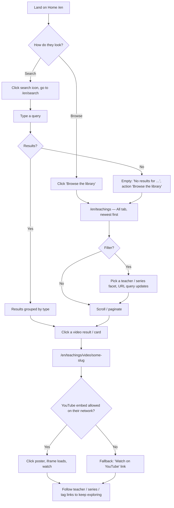
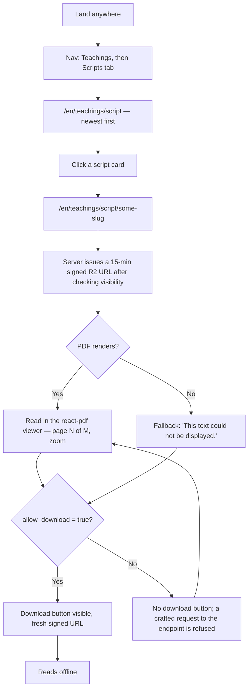
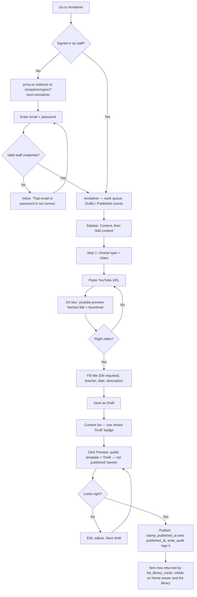

# App Flow Document — MVP Scope

**Project:** Bodhisamadhi Center — Dharma Web Platform
**Related:** [PRD](./PRD-Bodhisamadhi-Center.md) · [Tech note](./1-Tech-Note-Data-Storage-Research.md) · [App flow decisions](./2-App-Flow-Open-Questions.md) · [Tech stack](./3-Tech-Stack-and-Version-Lock.md) · [Design system](./4-Design-System-and-Content-Guidelines.md) · [Backend schema](./5-Backend-Schema-and-API.md) · [Implementation plan](./6-Implementation-Plan.md)
**Date:** August 30, 2026
**Status:** Authoritative for MVP screen behaviour. Supersedes the derived screen inventory in design system §3/§5 and backend §15 where this document says so (see §10).

---

## 1. How to use this document

`2-App-Flow-Open-Questions.md` recorded *what was decided*. This document turns those decisions into *screens*: where each one lives, who can reach it, what it shows, and what it shows when there is no data, when it is loading, and when something breaks.

It is written for the project owner and for the developer who will build from it. It is deliberately narrowed to the **MVP** as defined in `6-Implementation-Plan.md` §3 — the public library, search, the home page, and the admin surface that feeds them. Everything else the PRD describes is real, and is out of scope here.

### Rules of engagement

1. **This document defines behaviour, not values.** Every colour, size, string, component and state treatment comes from `4-Design-System-and-Content-Guidelines.md`. Where a screen needs a component, it is named, not designed.
2. **Copy is never improvised.** Empty-state and error text is quoted from design system §7.7 and §7.8 by reference. A screen that needs a string not in those sections is a gap — stop and ask.
3. **Every data surface implements all four states** (design system §4): loading, empty, error, populated. A screen is not done until all four have been seen working.
4. **No screen is referenced that this document does not define.** If a link points somewhere, that somewhere has a row in §5 or §6.
5. **RLS is the authorization boundary** (backend §13, §16.3). The `proxy.ts` admin guard and every "who can see it" line below is a convenience for the user's experience; it is never the thing that keeps data safe.

---

## 2. What is in and out of scope

### In scope — the screens this document specifies

| Group | Screens |
|---|---|
| **Marketing** | Home |
| **Teachers** | Masters index · Teacher detail |
| **Library** | Library index (All) · Video tab · Audio tab · Scripts tab · Video detail · Audio detail · Script detail · Series detail |
| **Search** | Search results |
| **System** | 404 · Error (500 / render failure) · Offline |
| **Admin** | Admin sign-in · Password-reset request · Password-reset landing · Work queue (admin landing) · Content list · Content form (new / edit) |

### Out of scope — deferred to the phase named

| Feature | Phase | Notes for this document |
|---|---|---|
| Member sign-up, sign-in, accounts, onboarding | 13 | The public site has **no "Sign in" affordance** in the MVP. Only staff authenticate, and only at `/{locale}/admin/signin`. |
| Members-only content gating | 13 | See §3.5 — the schema keeps `visibility`, but the MVP admin form offers **Public only**, and the library never renders a locked card. |
| Comments | 14 | Item detail pages reserve no space for a comments region in the MVP. |
| Service request forms, service detail pages, the pastoral disclaimer flow | 15 | Home keeps v4's static "what we offer" section; it links to nothing. |
| Live page, Q&A, the sitewide live banner | 16 | The banner **slot** exists in the layout (design system §3.21) and is never activated. |
| Donations, tax receipts, "Sponsor a Puja" | 17 | Home keeps v4's static "give" teaser; its buttons link to `mailto:` / the Home contact block, exactly as v4 does today. |
| Account area, notification e-mail, self-serve deletion | 18 | — |

---

## 3. Global behaviour

Everything in this section is true on every screen unless a screen's row overrides it.

### 3.1 Locale routing

- Locale is a path segment: `/en/…`, `/zh/…`, `/bo/…` (App Flow 0.3). `next-intl` with `localePrefix: 'always'` — there is no unprefixed URL.
- A request to `/` or to any path missing a locale is redirected to `/en/…` by `proxy.ts` (backend §16.3, step 1).
- Every page has three shareable, indexable addresses. The `<html lang>` attribute is set per locale (`en`, `zh-Hans`, `bo`) and drives the font stack (design system §2.5).
- The language switcher (design system §3.20) renders three links — `EN` · `中文` · `བོད` — each pointing at **the same page under the other locale**. It is never a client-side toggle. On a screen whose URL contains a slug, the switch keeps the slug; the content simply falls back per §3.8 if that locale's text is missing.

### 3.2 Chrome — present on every public screen

| Element | Behaviour | Component |
|---|---|---|
| **Skip-to-content link** | First focusable element on every page; visible on focus. | design system §6 |
| **Live banner slot** | Present in the layout, directly above the nav. **Never activated in the MVP** — no stream states exist. It adds no height while inactive. | §3.21 |
| **Navigation** | Sticky, transparent over a dark hero, `--glass` once scrolled past 40px. Brand at the leading edge; primary links centred; search icon and language switch at the trailing edge. **No "Sign in" link** (§2, out of scope). | §3.20 |
| **Nav links** | `Teachings` (→ `/{locale}/teachings`) · `Masters` (→ `/{locale}/masters`) · `Schedule` · `Support` · `Visit`. On the Home page the last three are in-page anchors (`#events`, `#give`, `#visit`). On every other page they are links to `/{locale}#events` etc. — the anchor resolves after navigation (App Flow 0.1, A1). No `Teachings` dropdown in the MVP: it is a plain link to the library index, whose tabs do the rest. |
| **Mobile nav** | Hamburger opening a full-height drawer from the trailing edge, for everyone. Focus trapped while open; Escape closes; `aria-expanded` / `aria-controls` on the toggle. No bottom tab bar (App Flow A3). | §3.20 |
| **Search** | Icon in the nav opens `/{locale}/search`. On mobile the icon routes straight to the search page rather than expanding inline. (App Flow A5 — global search; the MVP returns library results only.) | §3.22 route |
| **Footer** | v4's footer grown into sitemap columns — Teachings · Practice · Support · Contact — plus the charity-registration line (`#713674927RT0001`) and the Tibetan dedication. Links follow the same Home-anchor rule as the nav. | App Flow A7 |
| **Breadcrumbs** | On **library item detail and series pages only** (App Flow A6). Not on Home, Masters, the library index, or admin. | §3.14 |

### 3.3 The four states

Every list, grid, player and data surface below names its treatment for all four. The defaults, applied unless a row says otherwise:

| State | Treatment | Component |
|---|---|---|
| **Loading** | Skeletons matching the shape and expected count of the result. Never a bare full-page spinner. Never a blank screen. Media surfaces show a poster-proportioned `--n-200` block. | §3.16 |
| **Empty** | Empty-state block (§3.15) with copy taken **verbatim** from design system §7.7. "Nothing exists yet" and "your filters matched nothing" are different strings with different actions — never merged. | §3.15, §7.7 |
| **Error** | Inline alert (§3.19) with copy from §7.8, plus a retry action wherever retrying could plausibly help. | §3.19, §7.8 |
| **Populated** | The normal case. |

### 3.4 Motion

Per design system §2.10. **Marketing** surfaces (Home, Masters, Teacher detail) carry v4's full motion vocabulary — scroll reveals, staggered entrance, count-up, the word-by-word quotation effect — all neutralised under `prefers-reduced-motion`, including the JavaScript-driven effects, not only the CSS ones. **Application** surfaces (library index, item detail, search, admin) get functional motion only: hover, focus, open/close, loading. No reveals, no staggers, no count-ups on those screens.

### 3.5 Visibility and the absence of members

The `content_items.visibility` column exists in the schema (backend §7.1) and RLS enforces it (backend §13.4). But the MVP has no member accounts to enforce it *against*.

**Decision for the MVP (reconciles App Flow B16, design system §4.2, backend §13.4):**

- The admin content form offers visibility **Public only**. The `Members-only` option is disabled with the helper text *"Available once member accounts exist (Phase 13)."*
- `list_library_cards` and every library listing filter to `visibility = 'public'` in the MVP, so `is_locked` is always `false` and **no locked card is ever rendered**.
- The "visible with a lock badge / Sign in to watch" behaviour of App Flow B16 and design system §4.2 is correct and **activates in Phase 13**, not before. Until then there is nothing for it to describe.

This keeps the schema and RLS untouched, and avoids a dead-end "Sign in to watch" panel that would lead nowhere in a site with no sign-up.

### 3.6 Draft versus published

`content_items.status` is `draft` / `published` / `archived` (backend §3). In the MVP:

- The public site shows `published` items only. A draft is invisible to everyone who is not staff — enforced by RLS (backend §13.4), tested in Phase 2 (RLS test #2).
- Staff previewing a draft use a preview link from the admin content list (§5, admin content list row). The preview renders the public detail template with a persistent `status-off` "Draft — not published" banner at the top of the page.
- `archived` is not surfaced in the MVP admin UI. It exists for later.

### 3.7 Who "can see it" means, in this document

| Term | In the MVP |
|---|---|
| **Public** | Anyone, signed in or not. There is no distinction in the MVP because there are no member accounts. |
| **Staff** | A signed-in account holding `master` or `admin` in `user_roles` (backend §5.2). Reaches `/{locale}/admin/**`. |
| **Admin** | Staff holding `admin`. The MVP admin surface is small enough that master-vs-admin scoping shows up in exactly one place — a master may edit only their own content (backend §13.4, §17). Noted on the relevant rows. |

### 3.8 Missing translations

Content text is `jsonb` shaped `{en, zh, bo}` (backend §1). A missing key is not an error.

- **UI chrome** always exists in all three languages (design system §7.9 rule 1; enforced by the Phase 10 build check).
- **Content metadata** (a teaching's title / description, a teacher's bio) may be missing a locale. The screen shows the best available language and, inline, the note from design system §7.9 rule 5 / App Flow K64 — *"This teaching is not yet available in བོད་ཡིག."* The item is **never hidden** and the page is **never blank**.
- Fallback order: requested locale → `en` → `zh` → `bo` → the first key present.

### 3.9 Dates, numbers, formatting

Through `date-fns` locale objects, never assembled by hand (design system §7.9 rule 7). Times display in `America/Toronto` with the zone named. `recorded_at` is a date and renders as a date. Durations render as `H:MM:SS` / `MM:SS`.

---

## 4. Route tree

### 4.1 Public

```
/{locale}                                     Home
/{locale}/masters                             Masters index
/{locale}/masters/[slug]                      Teacher detail
/{locale}/teachings                           Library index — "All" tab
/{locale}/teachings/video                     Library — Video tab
/{locale}/teachings/audio                     Library — Audio tab
/{locale}/teachings/script                    Library — Scripts tab   (tab label: "Scripts")
/{locale}/teachings/video/[slug]              Video detail
/{locale}/teachings/audio/[slug]              Audio detail
/{locale}/teachings/script/[slug]             Script detail
/{locale}/teachings/series/[slug]             Series detail
/{locale}/search?q=…                          Search results
        ?teacher= &series= &topic= &lineage= &page=   facet + page state, on any /teachings* route
/{locale}/<anything unmatched>                404  (app/[locale]/not-found.tsx)
```

`{locale}` ∈ `en` · `zh` · `bo`. There is no route without a locale prefix; `proxy.ts` redirects.

**Error and offline are not routes.** They are React error boundaries: `app/[locale]/error.tsx` (a caught render/server error → the §6 Error screen), `app/global-error.tsx` (the layout itself failed), and an offline banner driven by `navigator.onLine` plus failed fetches.

### 4.2 Admin

```
/{locale}/admin/signin                        Sign in
/{locale}/admin/reset                         Request a password reset
/{locale}/auth/confirm                        Password-reset / token landing  (success · expired · used)
/{locale}/admin                               Work queue (admin landing)
/{locale}/admin/content                       Content list
/{locale}/admin/content/new                   New content form
/{locale}/admin/content/[id]/edit             Edit content form
        /{locale}/admin/content/[id]/preview  → renders the public detail template with a Draft banner (§3.6)
```

`proxy.ts` guards everything under `/{locale}/admin` **except** `/admin/signin` and `/admin/reset`: if `is_staff()` is false, redirect to `/{locale}/admin/signin?next=<path>` (backend §16.3). `/auth/confirm` is public — it has to be reachable from an e-mail link before a session exists.

Admin uses its own chrome (design system §3.23): 240px sidebar, no gradients, Inter headings, no emoji, `--wrap-admin`, `--t-fast` motion only. The public nav, footer, live-banner slot and language switcher are **not** present; a compact locale switch sits in the admin sidebar instead (App Flow H49 — the admin UI is fully trilingual).

---

## 5. Screen specifications

Each screen: **purpose · who can see it · key elements · entry points · exits · loading · empty · error**. Where a cell would just repeat §3, it says "per §3.x".

---

### 5.1 Home — `/{locale}`

| | |
|---|---|
| **Purpose** | The welcoming front door. Serves the Master's students, the wider community and complete newcomers at once (PRD §2). Carries v4's approved marketing content and one live data surface — the library teaser. |
| **Who** | Public. |
| **Key elements** | Ported v4 sections, in order (Phase 9): hero (video background, prayer-flag and petal motion) · "what we offer" (the twelve practice/service cards, static, linking nowhere in the MVP) · how-it-works (four steps) · testimonials + count-up stats · masters (three cards → Teacher detail) · schedule/events (static rows) · **library teaser** · give teaser (static, buttons `mailto:` / `#visit` as in v4) · CTA · visit & contact (address, phone, e-mail, hours, the Six Aspirations, charity number). The `.l-en`/`.l-zh`/`.l-bo` triple-span mechanism from v4 is **removed** — every string is a `next-intl` key (design system §1). |
| **Library teaser** | The six most recent `published`, `public` items across all types, newest first, via `list_library_cards` (backend §13.4). Each card → its detail page. A "Browse the library" link → `/{locale}/teachings`. |
| **Entry points** | Site root (after locale redirect) · brand/logo click from anywhere · nav "Home" is implicit in the brand · 404 and Error screens link here · external links and search engines. |
| **Exits** | Nav → `/{locale}/teachings`, `/{locale}/masters`; in-page anchors `#events` `#give` `#visit`. Masters cards → `/{locale}/masters/[slug]`. Library teaser cards → item detail. Teaser "Browse the library" → `/{locale}/teachings`. Footer links. `tel:` / `mailto:` from the visit block. |
| **Loading** | The static sections are server-rendered and need no loading state. The **library teaser** shows six card skeletons (§3.16) in its grid while `list_library_cards` resolves. |
| **Empty** | If the teaser query returns nothing (a fresh install, no published content): the teaser section renders the §7.7 *"The library is being prepared"* empty state instead of the grid, with no action. The rest of Home is unaffected. |
| **Error** | If the teaser query fails, the teaser section shows the §3.19 inline alert with the §7.8 *500* copy and a Retry. Home still renders — a teaser failure never takes down the page. |
| **Notes** | Lighthouse performance ≥ 85 on mobile with the hero video (Phase 9 acceptance). Hero `<video>` needs a `poster` and must not autoplay under `prefers-reduced-motion`. |

---

### 5.2 Masters index — `/{locale}/masters`

| | |
|---|---|
| **Purpose** | Introduce the teachers of the centre. |
| **Who** | Public. |
| **Key elements** | Page header (`h1`, one per page). A grid of teacher cards from the `teachers` table where `is_active` and not deleted, ordered by `display_order` (backend §6.1). Each card: portrait (or the §3.17 neutral fallback — never a stock silhouette), honorific + name **exactly** as design system §7.2 fixes them, a one-line role, a short bio excerpt. Whole card is one link (§3.5). |
| **Entry points** | Nav "Masters" · Home masters section · footer · Teacher detail breadcrumb-less "back". |
| **Exits** | A card → `/{locale}/masters/[slug]`. |
| **Loading** | Card-grid skeletons, count matching the number of active teachers (known at build/ISR time). |
| **Empty** | Not expected in production — the seed creates three teachers (backend §19). If it happens: §7.7 has no "no masters" string. **Reconciliation item — see §10.** Interim: the design system §3.15 empty-state pattern with heading *"Teacher profiles are being prepared"* and no action; flagged for the owner to confirm the exact copy in all three languages. |
| **Error** | §3.19 alert, §7.8 *500*, Retry. |

---

### 5.3 Teacher detail — `/{locale}/masters/[slug]`

| | |
|---|---|
| **Purpose** | One teacher: who they are, and what they have taught. |
| **Who** | Public. |
| **Key elements** | `h1` = honorific + name (§7.2). Portrait. Full bio (`jsonb`, locale fallback per §3.8). Below: **"Teachings from this master"** — a grid of that teacher's `published` `public` items, newest first, paginated at 24 (§3.13), reusing the library card (§3.6). A missing-locale bio shows the §3.8 inline note. |
| **Entry points** | Masters index card · Home masters section · a teacher's name on any library item detail page · a teacher facet chip on the library index. |
| **Exits** | An item → its detail page. Pagination → same route, `?page=`. The teacher's name is not a link to anywhere else. |
| **Loading** | Bio block renders server-side; the teachings grid shows card skeletons (24, or fewer if the count is known). |
| **Empty** | Teachings grid empty → §7.7 *"No teachings from this master yet"* / *"Recordings will appear here as they are published."* / no action. The bio still renders. |
| **Error** | Unknown slug → **404** (§6.1), not an empty page. Query failure on the grid → §3.19 alert + Retry, bio still shown. |

---

### 5.4 Library index and type tabs — `/{locale}/teachings`, `/teachings/video`, `/teachings/audio`, `/teachings/script`

| | |
|---|---|
| **Purpose** | The archive. A plain reverse-chronological list of everything published, filterable, with each content type reachable as its own URL. |
| **Who** | Public. |
| **Key elements** | Page header (`h1`). **Tabs** (§3.8) — `All` · `Video` · `Audio` · `Scripts` — each a real link (`/teachings`, `/teachings/video`, `/teachings/audio`, `/teachings/script`), `aria-current="page"` on the active one, horizontal scroll (never wrap) below `--bp-md`. **Facet sidebar** (§3.9), 260px sticky on desktop, a "Filters" bottom sheet below `--bp-lg`: groups for teacher, series, topic, lineage, and a date grouping. Applied facets appear as removable chips above the grid and are written to the URL query string (`?teacher=…&series=…`), so a filtered view is shareable and survives a refresh (App Flow B11). **Results grid** — library cards (§3.6), `.g3` desktop / 2-col `--bp-lg` / 1-col `--bp-md`. **Pagination** (§3.13), 24 per page, `?page=`. |
| **Sort** | Newest first (`published_at desc`), always. No "sort by" control. No curated "Start Here" row and no newcomer page (App Flow B10) — that burden sits on Home. |
| **Data** | `list_library_cards(_type, _limit, _offset)` (backend §13.4) for the grid; facet option lists and counts from a companion query. `_type` is `null` on `All`, else the tab's type. Filtered to `visibility='public'` in the MVP (§3.5). |
| **Entry points** | Nav "Teachings" · Home library teaser "Browse the library" · footer · a tag / teacher / series link from an item detail page (lands here with the matching facet applied) · search results "Browse the library" action · 404 page link. |
| **Exits** | A card → item detail. A chip's `×` → same route minus that param. Tab → the tab's route (facets that still apply are kept; a type-specific facet is dropped). Pagination → `?page=`. |
| **Loading** | Grid: 24 card skeletons (§3.16), container `aria-busy`. Facet sidebar renders its groups immediately; counts fill in with the grid. |
| **Empty — nothing published** | §7.7 *"The library is being prepared"* / *"Teachings will appear here as they are recorded. Please return soon."* / no action. Shown when the unfiltered type has zero items. |
| **Empty — filters match nothing** | A **different** state (§3.3): §7.7 *"No teachings match these filters"* / *"Try removing a filter, or browse everything."* / action **"Clear all filters"** → the tab route with no query. The distinction is mandatory. |
| **Error** | §3.19 alert above the grid, §7.8 *500*, Retry. Facet sidebar stays usable. |
| **Keyboard** | Every card and every control reachable and operable by keyboard; tab order follows visual order (Phase 5 acceptance). |

---

### 5.5 Video detail — `/{locale}/teachings/video/[slug]`

| | |
|---|---|
| **Purpose** | Watch one recorded teaching. Its own page — required for sharing, SEO and (later) comments (App Flow B8). |
| **Who** | Public (MVP — all published video is `public`, §3.5). |
| **Key elements** | Breadcrumb (§3.14): `Teachings · Video · {title}`. `h1` = title (locale fallback + §3.8 note if needed). **Player** — `lite-youtube-embed` (design system §3.22) in a 16:9 container, `--r-md`, `--n-200` background before load, **never `autoplay`**. Metadata block: teacher (→ Teacher detail), `recorded_at` date, tags (→ library index with that facet). If part of a series: **"Part N of M"**, series title (→ Series detail), and previous / next links (App Flow B14). Description (prose, capped at `--wrap-text`). **Related items** — a small row of other items by the same teacher or in the same series. **No transcript** in the MVP (App Flow B15). **No comments region** in the MVP (§2). |
| **Entry points** | Any library card (index, tab, teacher page, series page, Home teaser, related row) · search results · a shared/indexed URL · the archive of a past live session — *not in the MVP*. |
| **Exits** | Teacher name → Teacher detail. A tag → library index filtered. Series title / Part label → Series detail. Prev / Next → the sibling item. Related card → its detail page. Breadcrumb segments → the library index / Video tab. "Watch on YouTube" (only in the blocked-embed fallback). |
| **Loading** | Metadata and description server-rendered. The player shows its own `--n-200` poster block until the visitor clicks to load the iframe (that is how `lite-youtube-embed` works — the iframe is not loaded on page load). |
| **Empty** | Not applicable — a video detail page always has a video. A series with only this one part shows no prev/next and no "Part 1 of 1". |
| **Error — unknown slug** | **404** (§6.1). |
| **Error — embed blocked** | If the viewer's network blocks the YouTube iframe: the player area shows the §7.8 *"This video cannot be shown on your network."* message with a **"Watch on YouTube"** link built from `youtube_id`. The rest of the page is unaffected. |

---

### 5.6 Audio detail — `/{locale}/teachings/audio/[slug]`

| | |
|---|---|
| **Purpose** | Listen to a ritual chant or recorded audio teaching. |
| **Who** | Public. |
| **Key elements** | Breadcrumb `Teachings · Audio · {title}`. `h1` = title. **Player** — an in-page audio player with play/pause, elapsed / total, a seek bar. Playing an item also raises the **docked mini-player** (design system §3.22): fixed to the bottom, full width, 64px (52px below `--bp-sm`, seek bar hidden), `--cr-900`, survives navigation so playback continues while the visitor browses elsewhere, **never autoplays**, has a close control, is keyboard operable and labelled. Metadata: teacher, date, tags, series position — same as video. Description. Related items. |
| **Audio source** | The player does not hold a public URL. It calls `/api/media/[id]/url` (backend §15.2), which re-checks visibility server-side and returns a **15-minute signed R2 URL** (backend §14). A script/PDF's `allow_download` toggle does not apply to audio; audio is streamed, and whether a download link is shown follows the same per-item setting model (Phase 8). |
| **Entry points** | Audio library card anywhere · search results · shared URL. |
| **Exits** | Same as video detail. The mini-player's close button stops playback and dismisses it. |
| **Loading** | Player shows a disabled transport with a skeleton seek bar until the signed URL resolves. |
| **Empty** | Not applicable. |
| **Error — unknown slug** | **404**. |
| **Error — media fetch fails** | The player area shows the §7.8 *"The upload did not complete"* is wrong here — use the generic §7.8 *500* line *"Something went wrong on our side. Please try again in a moment."* with a Retry that re-requests the signed URL. **Reconciliation item §10** — §7.8 has no audio-specific failure string. |
| **Error — signed URL expired mid-listen** | The player silently re-requests a fresh URL on the next play/seek; the visitor is not shown an error unless the re-request also fails. |

---

### 5.7 Script detail — `/{locale}/teachings/script/[slug]`

| | |
|---|---|
| **Purpose** | Read a practice text in the browser, and download it when the item permits. |
| **Who** | Public. |
| **Key elements** | Breadcrumb `Teachings · Scripts · {title}`. `h1` = title. **PDF reader** — `react-pdf` (design system §3.22), container capped at `--wrap-text`, page controls above (page N of M, previous, next, zoom). **Download button** present **only when `allow_download` is true** for this item (App Flow B13) — an admin can switch it off for empowerment-only material while still allowing it to be read. Metadata: teacher, date, tags, series position. Description. Related items. |
| **PDF source** | Same signed-URL model as audio: `/api/media/[id]/url` re-checks `visibility` **and** `allow_download` server-side (backend §15.2). The download link, when shown, points at a fresh signed URL; a direct request to the endpoint with `allow_download` off is refused even if the caller crafts the URL (Phase 7 acceptance). |
| **Worker file** | `pdfjs-dist` is pinned at `5.4.296` and its worker is served from our own origin at that exact version (tech stack §6.3). A mismatch fails only at runtime, in the browser, when this page opens — it passes every build check. |
| **Entry points** | Script library card anywhere · search results · shared URL. |
| **Exits** | Same metadata exits as video/audio. Download (when present) → signed PDF URL. |
| **Loading** | Reader shows a skeleton at page proportions (§3.16) while the first page renders. |
| **Empty** | Not applicable. |
| **Error — unknown slug** | **404**. |
| **Error — PDF fails to load** | §7.8 *"This text could not be displayed. You can download it instead."* — with a download link **where `allow_download` permits it**; where it does not, the message stands alone. |

---

### 5.8 Series detail — `/{locale}/teachings/series/[slug]`

| | |
|---|---|
| **Purpose** | A multi-part teaching as an ordered whole (App Flow B14). |
| **Who** | Public. |
| **Key elements** | Breadcrumb `Teachings · {series title}`. `h1` = series title. Series description. The teacher (→ Teacher detail). An **ordered list of parts** — "Part 1", "Part 2", … — each a library card or a compact row, linking to the part's detail page, in `part_number` order. Parts that are still `draft` do not appear to the public. |
| **Entry points** | The series title or "Part N of M" label on any item detail page in that series · a series facet on the library index. |
| **Exits** | A part → its detail page. The teacher → Teacher detail. Breadcrumb → library index. |
| **Loading** | Parts list shows row skeletons. |
| **Empty** | A series with no published parts → §7.7 *"No teachings from this master yet"* is close but not exact; **reconciliation item §10** — there is no "empty series" string. Interim copy: *"The parts of this series are being prepared."*, no action, flagged for owner confirmation. A series with exactly one part is a valid populated state, not an empty one (App Flow I54 lists "a series with one part" as a state to handle — it simply shows one row and no prev/next on the part page). |
| **Error** | Unknown slug → **404**. Query failure → §3.19 alert + Retry. |

---

### 5.9 Search results — `/{locale}/search?q=…`

| | |
|---|---|
| **Purpose** | Find a teaching by title or description, in any of the three languages. |
| **Who** | Public. |
| **Key elements** | A search input, pre-filled from `q`. Results **grouped by type** (Video · Audio · Scripts) — weighted toward library items (App Flow A5). Each result is a library card or a compact result row → its detail page. The result count. Recent searches are **not** stored (Phase 6). |
| **Data** | `search_content(_q, _locale)` (backend §7.2) with the caller's locale: English uses `websearch_to_tsquery` full-text (so "teaching" matches "teachings"); `zh` and `bo` use trigram substring matching. RLS still applies to the returned rows, so nothing unpublished or deleted is ever returned (Phase 6 acceptance). |
| **Entry points** | The nav search icon (every page) · the 404 page's search box · the "browse" actions elsewhere do **not** come here — they go to the library index. |
| **Exits** | A result → its detail page. The no-results action → `/{locale}/teachings`. Submitting a new query → same route, new `q`. |
| **Loading** | Result-row skeletons under each type heading. |
| **Empty — no query** (`/search` with no `q`) | A calm prompt to search, plus a link to browse the library. **Reconciliation item §10** — §7.7 covers "no results" but not "no query yet". Interim: heading *"Search the library"*, body *"Find a teaching by title, teacher or topic."*, action "Browse the library". |
| **Empty — no results** | §7.7 *"No results for \"{query}\""* / *"Try a different word, or browse the library by topic."* / action **"Browse the library"** → `/{locale}/teachings`. |
| **Error** | §3.19 alert, §7.8 *500*, Retry (re-runs the same query). |

---

## 6. System screens

### 6.1 404 — `app/[locale]/not-found.tsx`

| | |
|---|---|
| **Purpose** | A wrong or dead URL, handled gently (App Flow I58). |
| **Who** | Public. |
| **Key elements** | The §7.8 copy: *"This page could not be found. It may have moved. Try searching, or start from the library."* A **search box** (submits to `/{locale}/search`). A link to `/{locale}/teachings`. A link to the Home "how it works" section (`/{locale}#how-it-works`). Full site chrome (nav, footer). |
| **Triggered by** | Any unmatched path under a valid locale; an unknown `[slug]` on any detail route calling `notFound()`. |
| **Exits** | Search · library · Home. |
| **States** | Static. No loading/empty/error of its own. |

### 6.2 Error — `app/[locale]/error.tsx` and `app/global-error.tsx`

| | |
|---|---|
| **Purpose** | A server or render error that a page-level boundary caught. |
| **Who** | Public. |
| **Key elements** | The §7.8 *500* copy: *"Something went wrong on our side. Please try again in a moment. If it keeps happening, please let us know at bodhisamadhicenter@gmail.com."* A **"Try again"** button (calls the boundary's `reset()`). A link to Home. `error.tsx` keeps the site chrome; `global-error.tsx` (the layout itself failed) renders a minimal standalone page with its own `<html>`/`<body>` and inline-critical styling only. |
| **Triggered by** | An unhandled exception in a Server Component, a route handler throwing, a data layer failure not caught locally. |
| **Reporting** | The error is sent to Sentry (`@sentry/nextjs`, wired in Phase 11). The visitor never sees a stack trace or an error id. |
| **States** | Static. |

### 6.3 Offline

| | |
|---|---|
| **Purpose** | The connection dropped (App Flow I57). |
| **Who** | Public. |
| **Key elements** | Not a page — a dismissible banner beneath the nav, shown when `navigator.onLine` is false or a navigation fetch fails with a network error. Copy from §7.8: *"You appear to be offline. Your work has been kept — reconnect and try again."* It clears itself when connectivity returns. |
| **Notes** | The MVP has no forms on the public site, so "your work has been kept" refers only to in-progress navigation; it becomes materially important in Phase 15+ (service request drafts). |

---

## 7. Admin screens

Admin chrome per design system §3.23 and route rules per §4.2. All admin copy is trilingual (App Flow H49) and **contains no emoji** (design system §2.8, §3.23).

### 7.1 Admin sign-in — `/{locale}/admin/signin`

| | |
|---|---|
| **Purpose** | Let the two (or more) staff accounts in. **Public sign-up is disabled** in the Supabase dashboard for the MVP (Phase 3) — accounts are created by invitation. |
| **Who** | Anyone can reach the page; only a valid staff credential gets through. |
| **Key elements** | `h1`. Email field, password field (§3.3 fields, labels always visible, never a placeholder-as-label). A "Sign in" primary button. A "Forgot your password?" link → `/{locale}/admin/reset`. No "create an account" link. No social sign-in in the MVP (Google is Phase 13). The compact admin locale switch is present so the page works in all three languages (Phase 3 acceptance). |
| **Entry points** | Direct URL · `proxy.ts` redirect from any guarded `/admin/**` path, carrying `?next=`. |
| **Exits** | Success → `?next=` if present and same-origin, else `/{locale}/admin` (the work queue). Failure → stays, shows the error. "Forgot your password?" → `/{locale}/admin/reset`. |
| **Loading** | The button enters its loading state (§3.1) — label replaced by a spinner, width fixed, `aria-busy`, disabled — while the credential is checked. |
| **Empty** | N/A. |
| **Error — bad credentials** | An inline alert (§3.19) above the form with the design system's authentication-failure copy. **Reconciliation item §10** — §7.8 has *"Session expired"* but no "email or password is incorrect" line. Interim: *"That email or password is not correct."* Never reveal which field was wrong. |
| **Error — not staff** | A credential that authenticates but holds no role: signed in, then immediately shown *"This account does not have access to the admin area."* and signed back out. `is_staff()` is false, so `proxy.ts` would bounce them anyway — this message makes the bounce legible. |
| **Error — unverified email** | Supabase refuses the sign-in; show *"Please confirm your email address first. Check your inbox for the confirmation link."* (Staff accounts are seeded pre-confirmed in Phase 3, so this is an edge case.) |

### 7.2 Password-reset request — `/{locale}/admin/reset`

| | |
|---|---|
| **Purpose** | Start a password reset by e-mail (Phase 3). |
| **Who** | Public (no session needed). |
| **Key elements** | `h1`. One email field. A "Send reset link" button. |
| **Behaviour** | On submit, **always** shows the same confirmation — *"If that address has an account, a reset link is on its way."* — whether or not the address exists. No account enumeration. Resend is rate-limited (Supabase default). |
| **Exits** | Confirmation panel with a link back to `/{locale}/admin/signin`. |
| **Loading / Error** | Button loading state; a generic §7.8 *500* alert on transport failure. |

### 7.3 Password-reset / token landing

> **As-built (Phase 3):** split into two routes. `resetPasswordForEmail` points the e-mail link at **`/{locale}/auth/confirm`**, a **Route Handler** (not a page) that exchanges the PKCE `code` server-side — a browser client cannot read the `code_verifier` cookie the server client wrote. It then redirects to **`/{locale}/auth/new-password`**, a page that shows the "set a new password" form (success) or the expired / already-used notice.

| | |
|---|---|
| **Purpose** | Where an e-mailed link lands. Must handle three outcomes distinctly (backend §16.1). |
| **Who** | Public — reached before a session exists. |
| **`/{locale}/auth/confirm`** (Route Handler) | Exchanges `?code` for a recovery session, or reads `?error` / `?error_code` from Supabase's `/auth/v1/verify`. Always redirects to `/{locale}/auth/new-password`, with `?error=expired` or `?error=used` on failure. |
| **`/{locale}/auth/new-password`** (page) | **Success:** a form — new password · confirm · submit → `updateUser({password})` → redirect to `/{locale}/admin`. **`?error=expired`:** *"This link has expired."* + a button → `/{locale}/admin/reset`. **`?error=used`:** *"This link has already been used."* + a link → `/{locale}/admin/signin`. |
| **Error** | A malformed or missing token is treated as **expired**. Passwords below the policy (12 chars, lower+upper+digit) are rejected with the hint text. |

### 7.4 Work queue — `/{locale}/admin` (admin landing)

| | |
|---|---|
| **Purpose** | "What needs your attention today" (App Flow H50). The first screen after sign-in. |
| **Who** | Staff. |
| **Key elements** | A `.g4` row of counter cards (design system §3.23, "Work queue landing screen"). In the MVP the only real counts are content-related — `admin_queue_counts()` reduced to what exists in the phase (Phase 3): **Drafts** (content in `draft`), **Published** (content in `published`). The comment / booking / e-Transfer / live counts from the full design (App Flow H50) are **not shown** — those features do not exist yet. Analytics are **not** on this screen (App Flow H50). Each non-zero count links to the content list, pre-filtered (`/{locale}/admin/content?status=draft`). A zero count renders in `--text-soft` and is not a link. |
| **All-clear** | When every count is zero (a fresh install), the row is replaced by the §7.7 *"Nothing needs your attention"* / *"The moderation queue is clear."* message. **Reconciliation item §10** — that string mentions "moderation queue", which does not exist in the MVP. Interim: reuse the heading, body *"There is no content waiting. Add a teaching to get started."*, with an "Add content" action → `/{locale}/admin/content/new`. Owner to confirm final trilingual copy. |
| **Entry points** | Post-sign-in redirect · the sidebar "Home" / dashboard item · `/{locale}/admin` typed directly. |
| **Exits** | A counter → the filtered content list. All-clear action → the new-content form. Sidebar → Content, sign out. |
| **Loading** | Counter-card skeletons (four). |
| **Error** | §3.19 alert with §7.8 *500* and Retry, inside the admin shell. |

### 7.5 Content list — `/{locale}/admin/content`

| | |
|---|---|
| **Purpose** | See and manage every teaching (Phase 4). |
| **Who** | Staff. A master sees all rows but can only open their own for editing (backend §13.4, §17); an admin can edit any. |
| **Key elements** | Page header with an **"Add content"** primary action → `/{locale}/admin/content/new`. Filters: **type** (All / Video / Audio / Script) and **status** (All / Draft / Published), reflected in the URL (`?type=&status=`). A **table** (design system §3.10, admin-only): columns — title (English, the required locale), type, status badge (`status-off` draft / `status-ok` published), teacher, `recorded_at` date, and a trailing actions cell. Below `--bp-md` each row becomes a stacked `label: value` card, not a horizontal scroll. Row actions as `ghost` buttons (never unlabelled icons): **Edit** (→ `/[id]/edit`; disabled with a tooltip for a master on someone else's row), **Preview** (→ `/[id]/preview`, opens the public template with the §3.6 draft banner), **Publish / Unpublish**, **Delete**. |
| **Publish / Unpublish** | Publish sets `status='published'`; `stamp_published_at` sets `published_at` if unset (backend §12.3). Unpublish returns the row to `draft`. Both are audited (backend §12.2). |
| **Delete** | Soft delete (`deleted_at`), behind a confirmation modal (§3.11) naming the item. Admin only (backend §13.4). Audited. |
| **Entry points** | Sidebar "Content" · work-queue counters (arriving pre-filtered) · after saving the content form. |
| **Exits** | Add / Edit / Preview per above. A row's title is not itself a link — the actions are explicit. |
| **Loading** | Table-shaped skeletons (§3.16), row count matching the page size. |
| **Empty — nothing created** | §3.15 empty state, §7.7 has no exact "no content in admin" string — **reconciliation item §10**. Interim: heading *"No teachings yet"*, body *"Add your first teaching to see it here."*, action **"Add content"**. |
| **Empty — filter matches nothing** | A distinct state: *"No teachings match these filters."* / action "Clear filters". |
| **Error** | §3.19 alert + Retry within the shell. |

### 7.6 Content form — `/{locale}/admin/content/new` and `/{locale}/admin/content/[id]/edit`

| | |
|---|---|
| **Purpose** | Add or change one teaching (Phase 4 for video; Phase 7 adds the script branch; Phase 8 adds audio). |
| **Who** | Staff. On `[id]/edit`, a master may open only their own item (RLS refuses the update otherwise, and the guard hides the route). |
| **Shape** | **Content type is chosen first** (App Flow H51). On `/new`, step one is a three-way choice — Video / Audio / Script — and the rest of the form is shaped to that type. On `/edit`, the type is fixed and shown read-only. |
| **Common fields** | **Title** — three tabs (`EN` / `中文` / `བོད`), **English required**, the others optional (backend §7.1; Phase 4 acceptance: an item saved without an English title is refused). **Description** — three tabs, all optional. **Teacher** — select from `teachers`. **Series** + **Part number** — optional; part number only enabled once a series is chosen (backend constraint `series_part_together`). **Recorded date**. **Visibility** — Public / Members-only, with **Members-only disabled** (§3.5). **Status** — Draft / Published (saving does not force publish; App Flow H52). |
| **Video branch** | A **YouTube ID or URL** field. On blur, `/api/admin/content/youtube-preview` (backend §15.5) fetches the title and thumbnail and shows them, so the admin confirms the right paste before saving (App Flow H51). The stored value is the 11-character `youtube_id`; the `CHECK (youtube_id ~ '^[A-Za-z0-9_-]{11}$')` constraint rejects a bad value and the form surfaces the §7.8 message (Phase 4 acceptance). |
| **Audio branch** (Phase 8) | An **MP3 upload** to R2 via a signed URL from `/api/admin/upload-url` (backend §15.5), with a progress indicator, content-type and size validated server-side. Duration is captured. |
| **Script branch** (Phase 7) | A **PDF upload** to R2, same signed-URL flow. **Page count**. An **"Allow download"** toggle (default on) — off means the text can be read on-site but not downloaded (App Flow B13). |
| **Validation** | Zod schema shared by client and server (tech stack §4). Validation on **blur** for a field the user has left, and on **submit** for everything — never on every keystroke (design system §4.1). On a failed submit: focus moves to the first invalid field; an inline alert (§3.19) above the form lists each failing field as a link to it; nothing typed is discarded. |
| **Entry points** | "Add content" from the list or the work-queue all-clear; "Edit" from a list row. |
| **Exits** | **Save draft** → returns to the content list with a success toast (§3.12, "Draft saved"). **Save & publish** → same, "Published". **Preview** (edit mode) → `/[id]/preview`. **Cancel** → back to the list; if the form is dirty, a confirmation modal (§3.11). |
| **Loading** | Field-level: the YouTube preview shows a small spinner while fetching. Submit: the button's loading state (§3.1). Upload: a determinate progress bar. |
| **Empty** | N/A — a form. |
| **Error — YouTube preview fails** | Inline, next to the field: *"Could not read that video. Check the ID or link."* The admin can still save if the ID passes the format check; the preview is a convenience, not a gate. **Reconciliation item §10** — no exact string in §7.8. |
| **Error — upload too large** | §7.8 *"This file is larger than the {limit} limit. Please upload a smaller file."* with the limit interpolated. |
| **Error — upload failed** | §7.8 *"The upload did not complete. Please try again."* The rest of the form state is kept. |
| **Error — save fails** | §3.19 alert above the form, §7.8 *500*, the button returns to its resting state, nothing is lost. |
| **Stop condition** (Phase 7) | If the `pdfjs-dist` worker will not load, **stop** — do not upgrade the package to make it work (tech stack §6.3, Phase 7). |

---

## 8. Journeys

Three Mermaid diagrams, per Phase 0's brief. They render natively on GitHub.

### 8.1 A visitor finds and watches a teaching



### 8.2 A visitor reads a practice text



### 8.3 An admin publishes a lecture



---

## 9. Cross-cutting patterns

### 9.1 Skeletons

Every grid and list uses `--n-200` skeletons with the 1.4s shimmer (static block under reduced motion), `aria-busy` on the container, count matching the expected result count where known (design system §3.16). Never a skeleton for a button or an in-flight action — those use the button's own loading state.

### 9.2 The two empty states

"Nothing exists yet" and "your filters/query matched nothing" are always separate, with separate copy and separate actions (§3.3, design system §4). This applies to: the library index (per tab), search, a teacher's teachings grid, the admin content list, and the Home library teaser (which only has the first kind).

### 9.3 Error copy

Taken verbatim from design system §7.8. Where §7.8 lacks a needed line, this document uses an interim string and flags it in §10 — it is never invented silently and never left in English only (the interim strings still need `zh` and `bo` before they ship, per design system §7.9).

### 9.4 Deliberately awkward states to build and verify (App Flow I57, Phase 11)

- YouTube embed blocked by the viewer's network → "Watch on YouTube" fallback (§5.5).
- PDF fails to load → download-or-nothing fallback (§5.7).
- Offline mid-navigation → the §6.3 banner.
- A signed media URL expiring while the visitor is on the page → silent re-request (§5.6, §5.7).
- The Home library teaser query failing while the rest of Home renders (§5.1).

### 9.5 Accessibility floor (design system §6, Phase 1 & 11 acceptance)

Skip link first; one `<h1>` per page, no skipped levels; every control keyboard-operable in visual order; focus visible per design system §2.9 on every interactive element; contrast only from design system §2.4; `lang` correct on `<html>` and on any inline language switch; touch targets ≥ 44×44; nothing signalled by colour alone; layout survives 200% zoom and a 320px viewport; `prefers-reduced-motion` honoured everywhere including JS effects. Tested at 320 / 480 / 700 / 960 / 1440px in all three locales.

---

## 10. Reconciliation log

Where this document corrects or extends design system §3/§5 or backend §15, per Phase 0's brief ("correcting either where they disagree").

### 10.1 Corrections adopted here

| # | Point | Resolution |
|---|---|---|
| R1 | **Nav "Sign in / avatar"** (App Flow A1, design system §3.20) | ~~Removed from the public nav in the MVP — there are no member accounts.~~ **Re-added in Phase 13** (`Docs/9` §5.9, PR 2). A guest sees a "Sign in" link at the trailing edge by the language switch; a signed-in member sees their display name (initials / a neutral circle — no avatar upload until Phase 18) with a "Sign out" control. Still **no "Account" link** — the account area is Phase 18. Staff continue to reach `/{locale}/admin/signin` directly. |
| R2 | **Nav "Teachings ▾" dropdown** (App Flow A2, design system §3.20) | No dropdown, in the MVP or Phase 13. `Teachings` is a plain link to `/{locale}/teachings`; the tabs there cover Video / Audio / Scripts. |
| R3 | **Members-only locked cards** (App Flow B16, design system §4.2, backend §13.4) | ~~Not rendered in the MVP.~~ **Activated in Phase 13** (`Docs/9`). The admin form now offers Public / Members-only / **Restricted** (per-empowerment, hidden entirely); `list_library_cards` returns the locked-card projection for guests. `queries.ts` no longer pins `visibility='public'` — RLS scopes it. |
| R4 | **"Services" / "Live" / "Schedule" / "Support" as nav routes** (App Flow A1) | In the MVP these are Home sections only. The nav links resolve to `/{locale}#anchor`. Real routes arrive in Phases 15 / 16. |
| R5 | **Work-queue counters** (App Flow H50, design system §3.23) | The MVP shows Drafts / Published only. Comments, bookings, e-Transfers and live status are omitted until their features exist. Analytics stay off this screen, as specified. |
| R6 | **Type-tab URL segment** (design system §3.8 label "Scripts" vs backend detail route `/script/[slug]`) | The Scripts tab route is `/{locale}/teachings/script` (singular segment, matching the detail route). The visible tab **label** is "Scripts" from the message catalogue. Listing and detail share the `script` segment so no subtle split exists. |
| R7 | **`/api/services` and `/api/live/current`** (backend §15.1) | Not called in the MVP. Home's service and schedule sections are static v4 content (Phase 9). Only the library teaser hits the database (`list_library_cards`). |
| R8 | **Audio download vs `allow_download`** (backend §7.1 note "ignored for other types") | Confirmed: `allow_download` governs the Scripts download button only. Audio is streamed via a signed URL; any audio download affordance in Phase 8 follows a separate per-item setting, not `allow_download`. |

### 10.2 Missing copy — strings this document needs that design system §7.7 / §7.8 do not yet contain

> **Folded in 2026-09-02 (BACKLOG §2.6).** The English for C1–C10 is now in design system §7.7 / §7.8 — C1–C3, C7, C8 as §7.7 rows; C5, C6, C9 as §7.8 rows; C4 and C10 as notes after the §7.8 table. The table below is the record of where each came from. `zh` and `bo` in the message catalogue remain machine-generated and gated on Geshe-la's review.

Each is used with an **interim English string** noted at its screen. All still require `zh` and `bo` before shipping (design system §7.9). **Owner / design-system owner to confirm final wording.**

| # | Where | Needed string (kind) | Interim English |
|---|---|---|---|
| C1 | Masters index (§5.2) | Empty — no teachers | "Teacher profiles are being prepared." |
| C2 | Series detail (§5.8) | Empty — no published parts | "The parts of this series are being prepared." |
| C3 | Search (§5.9) | Empty — no query entered yet | "Search the library" / "Find a teaching by title, teacher or topic." |
| C4 | Audio detail (§5.6) | Error — media fetch failed | (falls back to the §7.8 *500* line; a dedicated audio line would be warmer) |
| C5 | Admin sign-in (§7.1) | Error — bad credentials | "That email or password is not correct." |
| C6 | Admin sign-in (§7.1) | Error — authenticated but not staff | "This account does not have access to the admin area." |
| C7 | Admin work queue (§7.4) | All-clear, MVP variant | "There is no content waiting. Add a teaching to get started." |
| C8 | Admin content list (§7.5) | Empty — nothing created | "No teachings yet." / "Add your first teaching to see it here." |
| C9 | Admin content form (§7.6) | Error — YouTube preview failed | "Could not read that video. Check the ID or link." |
| C10 | Draft preview banner (§3.6) | Status banner | "Draft — not published." |

### 10.3 Additions to `4-Design-System-and-Content-Guidelines.md` §10 open items

- The App Flow Document now exists (design system §10 item 3 is closed). §3 (components) and §5 (page templates) are reconciled against it above; the component inventory in §3 stands, with R1–R6 noted.
- ~~The missing strings in §10.2 should be folded into design system §7.7 / §7.8~~ **Done 2026-09-02 (BACKLOG §2.6)** — English folded in; `zh`/`bo` ride with the Phase 12 Tibetan review.

---

## 11. Open items carried forward

These are unchanged by this document and still block the phase named. From `6-Implementation-Plan.md` §9 and design system §10:

| # | Item | Blocks |
|---|---|---|
| ~~1~~ | ~~**Chinese name of the centre**~~ | **Resolved 2026-09-02 — 菩提禅院**, already used throughout the message catalogue. |
| 2 | **Tibetan review by Geshe-la** — all Tibetan in v4 and the docs is machine-generated | Phase 12 — a launch gate. This document adds interim Tibetan needs (§10.2); flag them for the same review. |
| 3 | **Real masters' content** — bios in three languages, portraits, slugs | Phase 9 (Masters), and the seed for Phase 2. |
| 4 | **Real schedule / stats** — the Saturday time(s), whether v4's count-up figures are accurate | Phase 9 (Home). |
| 5 | **5–10 real lectures + 1–2 practice texts** | Phase 12 (Master review); useful for realistic seed data earlier. |
| 6 | **Hosting: AWS vs Vercel** | Not blocking the MVP build. Still open. |
| ~~—~~ | ~~**Domain**~~ | **Decided 2026-09-02** — launch origin is `https://bodhisamadhi-web.vercel.app` (`NEXT_PUBLIC_SITE_URL` in Vercel); real domain is a later migration. Unblocks the §3.1 canonical / hreflang addresses and the sitemap. |
| ~~7~~ | ~~**R2 bucket name**~~ | **Resolved** — `R2_BUCKET=bodhisamadhi`, confirmed against the Cloudflare dashboard; in `.env.local`, `.env.hosted` and Vercel. |

---

## 12. Phase 2 screens — noted, not specified

Documented in full when their phase is planned (`6-Implementation-Plan.md` §5). Flagged here so no one builds toward them now:

- ~~**Member accounts** (Phase 13)~~ **Built and merged** (`Docs/9`, PRs #38 + PR 2): sign-up with e-mail verification, the one-step `/welcome` onboarding, the full-page `/{locale}/signin` pattern (the desktop sign-in **modal** is built but deferred — see `Docs/9` §13), the `members` gated panel + lock badge, and the `restricted` per-empowerment tier with its admin surfaces. **Not** in Phase 13: Google OAuth / identity linking (F13.d), the account area (Phase 18). R1 above is re-added; R3 is live.
- **Comments** (Phase 14): threaded one level, pending-visible-to-author, the admin moderation queue, and the work-queue counter becoming real.
- **Service requests** (Phase 15): nine service pages, the request form, guest submission, the pastoral disclaimer above the fields, staff notes, two booking e-mails.
- **Live** (Phase 16): the six page states, the waiting room, post-moderated Q&A, the sitewide live banner activating, the archive hand-off into the library.
- **Donations** (Phase 17): Stripe Checkout, PayPal, EMT with generated reference codes and admin reconciliation, CRA receipts, the monthly-gift portal.
- **Account area & e-mail** (Phase 18): profile, my requests, my donations & receipts, my comments, notification preferences, self-serve deletion.

---

*Prepared for Bodhisamadhi Center. May all sentient beings be happy.*
